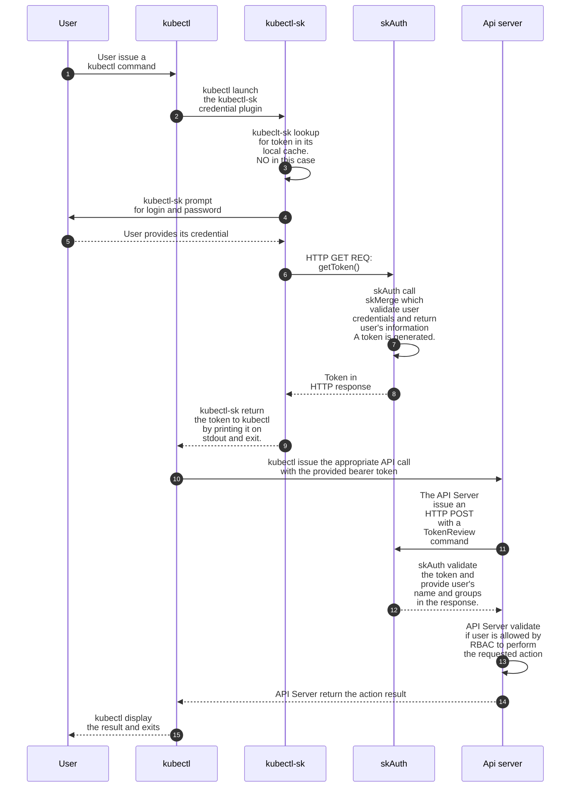
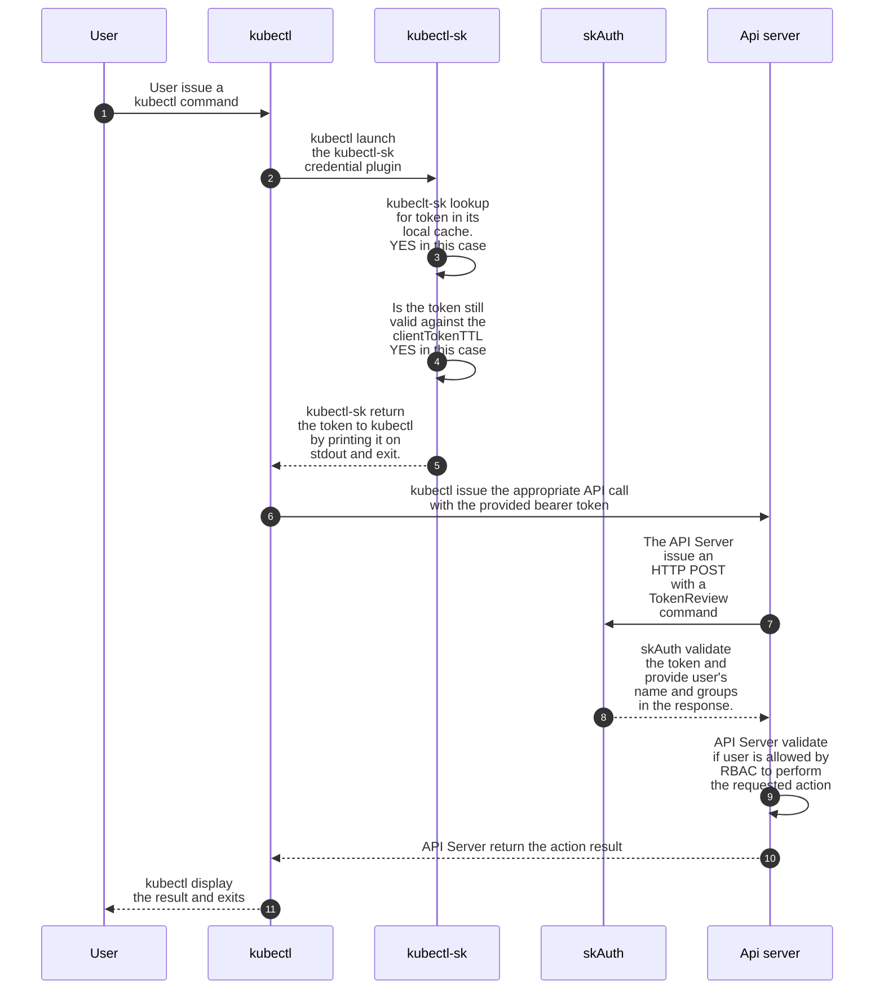
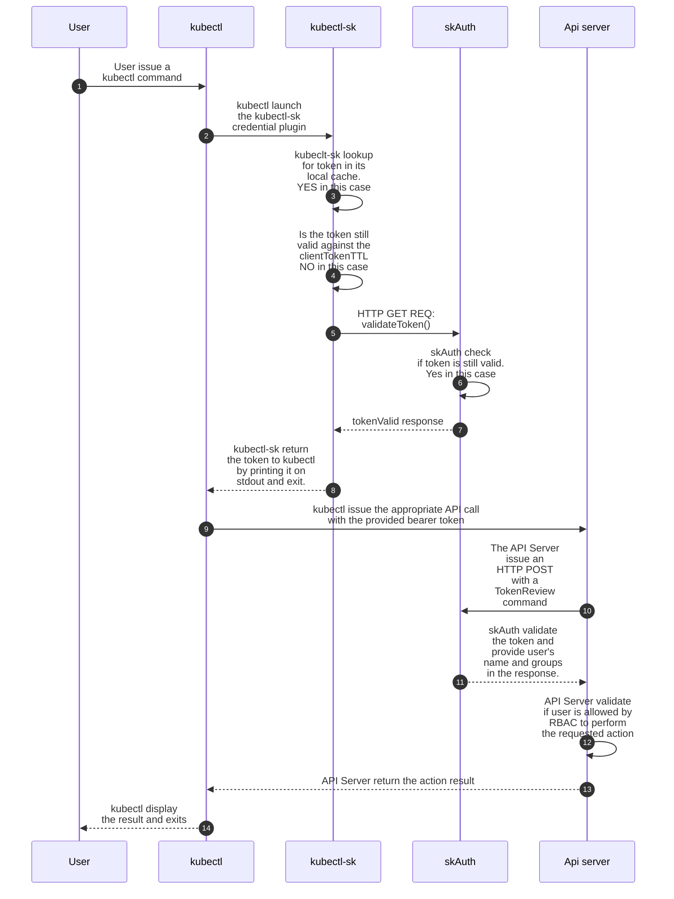
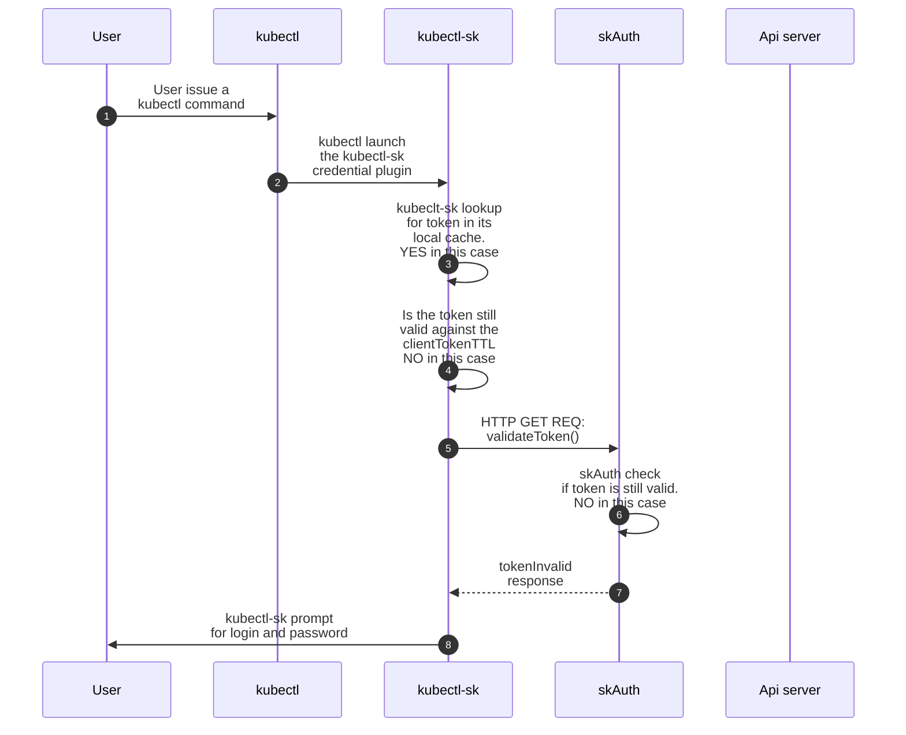

# Architecture

## Overview

### Initial deployment

Here are the different modules involved in SKAS authentication right after base installation:

{ align=left width=350}

SKAS is deployed as a Kubernetes Pod, hosting three containers:

- `skAuth` which is responsible for delivering Kubernetes tokens and validating them.
- `skmerge`, which is responsible for building a consolidated identity from several Identity Providers. In this 
configuration, with only one provider, it acts as a simple passthrough.
- `skCrd`, which is an Identity Provider storing user's information in the Kubernetes storage, in the namespace `skas-admin`.

In this schema, the arrows represent the main communication flow between the components, all of which involve HTTP exchanges.

{width=700}

Here is a summary of the exchange for an initial interaction:

- The user issues a `kubectl` command (such as `kubectl get pods`). For this, a token is needed. It will be provided by the `kubectl-sk` client-go credential plugins.
- `kubectl-sk` prompts the user for login and password, then issues a `tokenCreate()` request to the `skAuth` module.
- The `skAuth` module issues a `getIdentity()` request with user credentials. This request is forwarded to the `skCrd` module.
- The `skCrd` module retrieves the user's information, checks password validity, and sends the information upward to the `skMerge` module, which forwards them to the `skAuth` module.
- The `skAuth` module generates a token and sends it back to the `kubectl-sk` module, which forwards it to `kubectl`.
- `kubectl` sends the original request with the token to the Kubernetes API server.
- The API Server sends a `tokenReview()` request to the `skAuth` module, which replies with the user's information (user id and groups).
- The API Server applies its RBAC rules on user's information to allow or deny the requested operation.

For a more detailed description of this interaction, you can refer to the [sequence diagram](#sequence-diagrams).

### LDAP setup

{ align=right width=400}

This schema describes the architecture when an LDAP server has been configured, as detailed in the [previous chapter](./ldap.md).

The `skMerge` module is now connected to two identity providers: `skCrd` and `skLdap`, with `skLdap` being linked to an external LDAP server.

{width=700}

## Modules and interfaces

Here is a description of the modules comprising SKAS and their interfaces:

### Identity providers (skCrd, skLdap, skStatic)

> The `skStatic` provider hosts its user database in a configMap. It was used for testing during the primary development stages.
It is now deprecated and undocumented.

Under the default configuration, interfaces provided by these modules are associated with an HTTP server bound to `localhost`,
making them accessible only from another container in the same pod (typically `skMerge`).

#### Identity

These modules provide an `identity` interface. The request contains the user's login and optionally the user's password.

The response will convey the user's information (UID, common names, emails, groups) if the user is found, along with a status:

- `UserNotFound`: If the user does not exist in this provider.
- `PasswordUnchecked`: If the password was not provided in the request or if there is no password defined by this provider.
- `PassswordChecked`: If a password was provided in the request and the provider validates it.
- `PasswordFailed`:  If a password was provided in the request and the provider does not validate it.
- `Disabled`:  If the user is found but its `disabled` flag is set.
- `Undefined`: If the provider is out of order (for example, if the LDAP server is down).

#### PasswordChange

The `skCrd` provider also handles another interface: `passwordChange`, which allows password modification by providing the old
and new password (the latter in its hashed form).

### skMerge

Under the default configuration, the interfaces provided by this module are associated with an HTTP server bound
to `localhost`, making them accessible only from another container in the same pod (typically `skAuth`)."

#### Identity

The `skMerge` module supports the same `identity` interface as a provider. Of course, the returned value is the merge of information from its underlying providers.

This module also supports some extensions of this `identity` protocol:

- The returned result also indicates which provider was the 'authority' (the one that validates the password) for this user.
- The request can include a `detailed` flag. If set, the response will include a detailed list of responses from each 
provider. This is intended to be displayed by the `kubectl-sk user describe` CLI command."

#### PasswordChange

The `skMerge` module also supports a `passwordChange` interface. The request must contain the user's authority, which is the target provider to which this message will be forwarded.

### skAuth

Under the default configuration, all interfaces provided by this module are exposed to the outside world through an 
ingress controller. They are secured using end-to-end SSL, with SSL termination handled by the module itself, and the 
ingress configured in SSL passthrough mode.

Except for the `login` and `tokenReview` interfaces, all others in this module are designed to be called from the `kubectl-sk` client executable.

#### TokenCreate

The `tokenCreate` request contains a user's login and password. If the authentication is successful, a token is generated. The response will include:

- The generated token.
- User information for the `whoami` subcommand.
- The clientTTL for token expiration in the client's local cache.
- The authority, indicating the provider that validated the login/password.

#### TokenRenew

The `tokenRenew` interface check if the token is still valid and renew (touch) it.
The `tokenRenew` interface checks if the token is still valid and renews (touch) it.

#### PasswordChange

This is a simple passthrough that forwards the request to the underlying `skMerge` provider.

#### Kubeconfig

This interface provides a set of information that allows `kubectl-sk` to create an entry in the client config file, 
typically located at `~/.kube/config`, for accessing the targeted SKAS-enabled cluster. This enables automatic client-side configuration.

#### Identity

This interface is intended to be called for a `kubectl-sk user describe` operation. It forwards the request to the 
underlying `skMerge` module. However, since this operation is reserved for the SKAS administrator, the caller must 
provide authentication credentials, typically its token, to ensure they have the necessary rights

#### Login

This interface checks user credentials. If successful, the user's information is provided in the response. It is intended to be used by other applications, such as the DEX connector.

This interface is disabled by default in the configuration.

#### TokenReview

This interface is designed to support [Webhook Token Authentication](https://kubernetes.io/docs/reference/access-authn-authz/authentication/#webhook-token-authentication). 
It will be invoked by the Kubernetes API server to validate a token and retrieve associated user attributes.

## Interfaces exposition

Each interface can be exposed at three levels:

- Locally, accessible only from other containers in the same pod.
- Internally within Kubernetes, by creating a Kubernetes Service.
- Externally outside Kubernetes, by configuring a Kubernetes ingress controller.

For each module, every exposed API can be accessed on two ports:

- One is associated with a server bound to localhost, enabling intra-pod communication. In configuration files, 
this interface is referred to as the `internal` one.
- The other is associated with a server bound to the pod interface, designed to be exposed as a service or through an 
ingress. Communication on this interface is always encrypted using SSL. In configuration files, this interface is 
referred to as the `external` one.

Depending on the configuration, either one or both ports can be activated.

In the default configuration:

- Only the port bound to localhost is activated for the `skCrd`, `skLdap`, and `skMerge` modules. 
- For the `skAuth` module, only the port bound to the pod interface is activated.

## Sequence diagrams

### Initial user connexion

Below is the sequence of events for a successful initial connection:

### Token renewal

Here is the sequence when a valid token is already present in the client's local cache.

Here is the sequence when a token is still valid, but the short-lived local cache has expired.

### Token expired

Here is the sequence when a token has expired.

