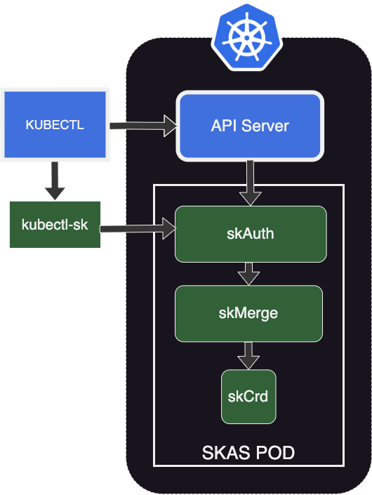
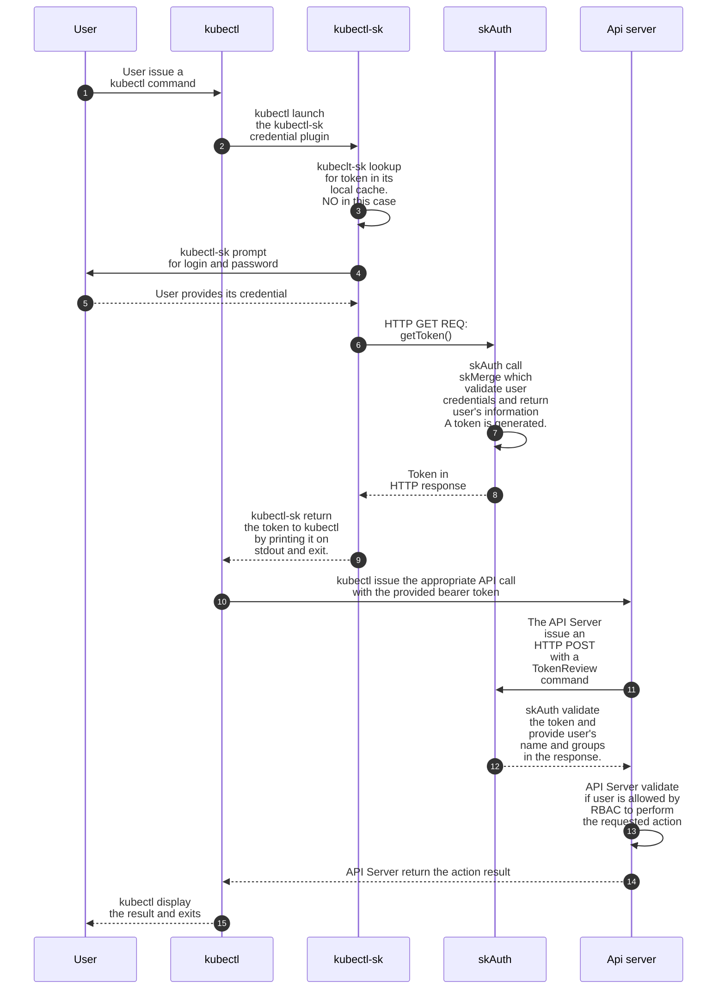
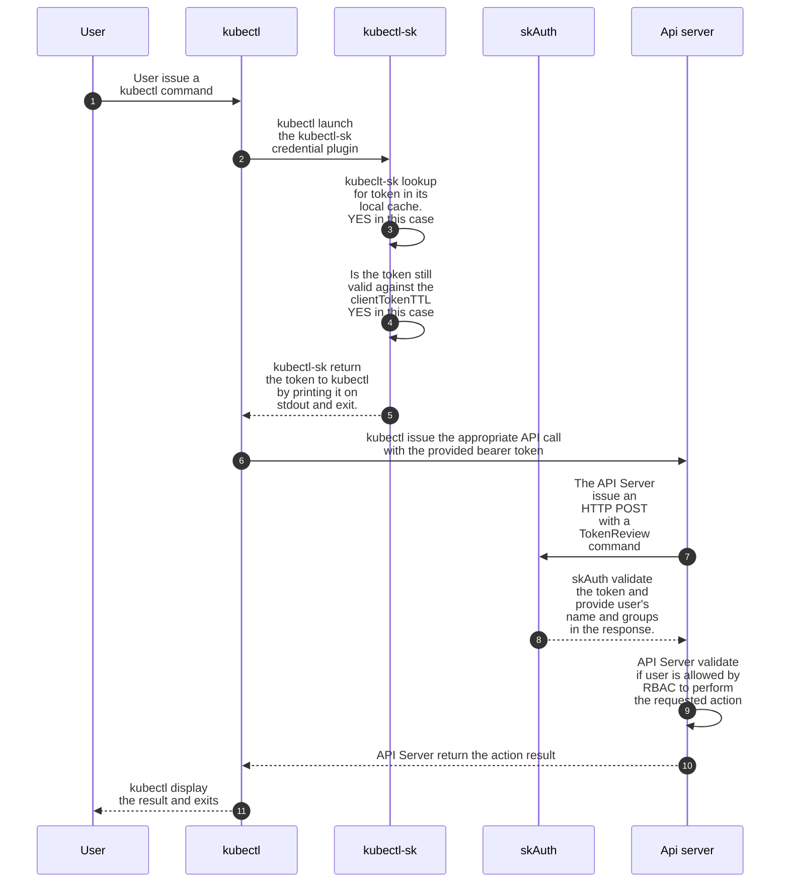
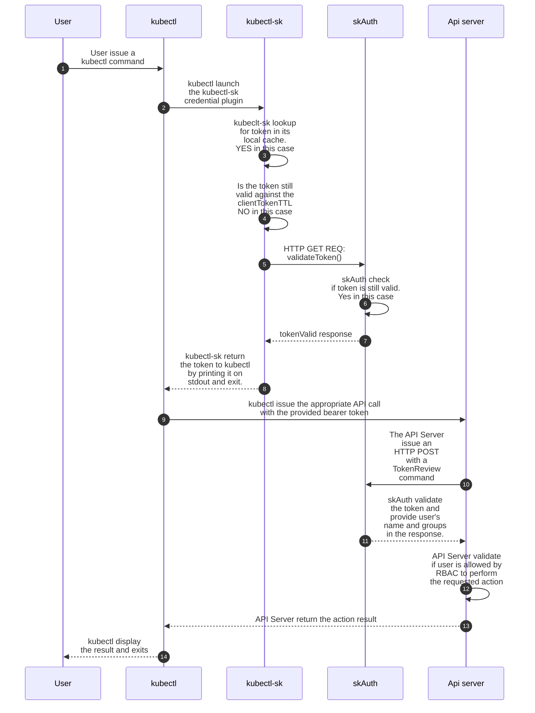
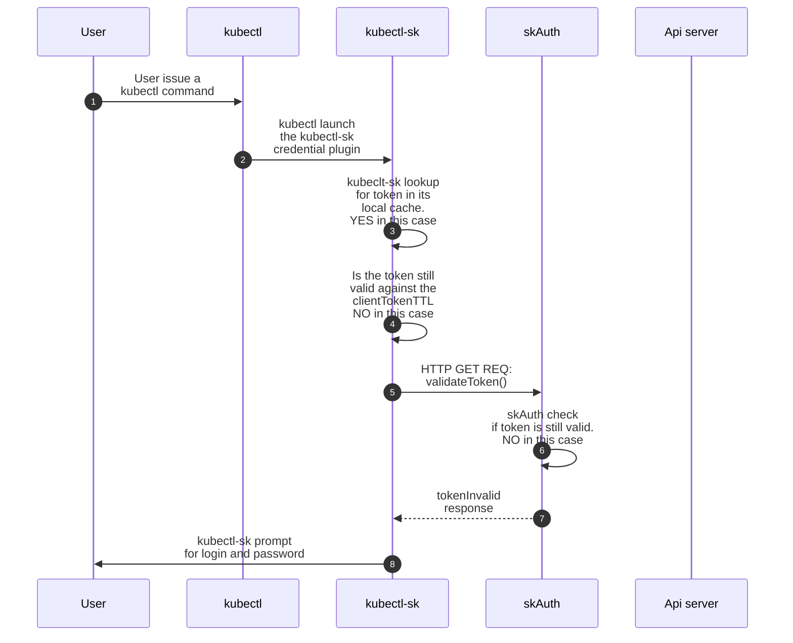

# Architecture

## Overview

### Initial deployment

Here is the different modules involved for a SKAS authentication, right after installation: 

{ align=left width=350}

SKAS is deployed as a Kubernetes Pod, this pod hosting three containers:

- `skAuth` which is in charge of delivering Kubernetes tokens and validate them.
- `skmerge`, which is in charge of building a consolidated identity from several identity providers. As in this configuration there is a single one, it act as a simple passthrough
- `skCrd`, which is an identity provider storing user's information in the Kubernetes storage, in namesapce `skas-admin`.

Arrow figure out the main communication flow between components. All of them are HTTP exchanges.

{width=700}

Here is a summary of exchange for an initial interaction

- The user issue a `kubectl` command (such as `kubectl get pods`). For this, a token is needed. It will be provided by the `kubectl-sk` client-go credential plugins.
- `kubectl-sk` prompt the user for login and password, then issue a `tokenCreate()` request to the `skAuth` module.
- The `skAuth` module issue a `getIdentity()` request with user credential. This request is forwarded to the `skCrd`module.
- The `skCrd` module retrieve user's information, check password validity and send information upward, to the `skMerge` module, which forward them to the `skAuth` module.
- The `skAuth` module generate a token and send it back to the `kubectl-sk` module. Which forward to `kubectl`.
- `kubectl` send the original request with the token to the Kubernetes API server
- The API Server send a `tokenReview()` request to the `skAuth` module, which reply with the user's informations (user id and groups).
- The API Server apply its RBAC rules on user's information to allow or deny requested operation. 

There is a more detailed description of this interaction as [sequence diagram](./architecture.md#sequence-diagrams).

### LDAP setup

{ align=right width=350}

This schema describe the architecture when an LDAP server has been configured, as described in a [previous chapter](./ldap.md).

The `skMerge` module is now plugged on two Identity providers: `skCrd` and `skLdap`.

And `skLdap` is connected to an external LDAP server

{width=700}

## Modules and interfaces

Here is a description of the modules composing SKAS and their interfaces:

### Identity providers (skCrd, skLdap, skStatic)

> The `skStatic` provider host its user database in a configMap. It was used for testing in in primary development stages. 
It is now deprecated and undocumented.

Under default configuration, interfaces provided by this module are associated to an HTTP server bound on `localhost`, 
thus accessible only from another container in the same pod (Typically `skMerge`).

#### Identity

These module provides an `identity` interface. The request contains user login and optionally the user password.

The response will convey user's information (uid, commonNames, emails, groups) if the user is found and a status:

- `UserNotFound`: If the user does not exists in this provider
- `PasswordUnchecked`: If the password was not provided on the request or if there is no password defined by this provider.
- `PassswordChecked`: If a password was provided in the request and the provider validate it.
- `PasswordFailed`: If a password was provided in the request and the provider does not validate it.
- `Disabled`: The user is found, but its `disabled` flag is set
- `Undefined`: The provider is out of order (i.e the ldap server is down)

#### PasswordChange

The `skCrd` provider also handle another interface: `passwordChange`, which allow password modification by providing old
and new password (This last in its hashed form)

### skMerge

Under default configuration, interfaces provided by this module are associated to an HTTP server bound on `localhost`,
thus accessible only from another container in the same pod (Typically `skAuth`)

#### Identity

The `skMerge` module support the same `identity` interface as a provider. Of course, the returned value is the merge of its underlying providers information.

This module also support is some extension of this `identity` protocol:

- The returned result also indicate which provider was the 'authority' (The one who validate the password) for this user.
- The request can support a `detailed` flag. If set, the response will be completed with a detailed list of response from each provider. This is aimed to 
be displayed by the `kubectl-sk user describe` CLI command. 

#### PasswordChange

The `skMerge` module also support a `passwordChange` interface. The request must contains the user's authority which is the target provider to which this message will be forwarded.

### skAuth

Under default configuration, all interfaces provided by this module are exposed to outside world through an ingress controller. 
They are secured using SSL, from end to end (SSL termination is handled by the module itself, the ingress being configured in SSL passthrough mode).

Except `login` and `tokenReview`, all other interfaces of this module are intended to be called from the `kubectl-sk` client executable.

#### TokenCreate

The `tokenCreate` request contains a user login and password. If the authentication succeed, a token is generated. The response will contains:

- The generated token
- User's information, for `whoami` subcommand.
- The clientTTL, for expiration of the token in the client local cache.
- The authority, the provider who validate the login/password.

#### TokenRenew

The `tokenRenew` interface check if the token is still valid and renew (touch) it.

#### PasswordChange

This is a simple passthrough, which forward the request to the underlying `skMerge` provider.

#### Kubeconfig

This interface provide a set of informations allowing `kubectl-sk` to create an entry in the client config file (typically `~/.kube/config`), 
to access the targeted SKAS enabled cluster. This to allow automatic client side configuration.

#### Identity

This interface is intended to be called for a `kubectl-sk user describe` operation. It forward the request to the underlying `skMerge` protocol.
But, as this operation is reserved the the SKAS administrator, the caller must provide authentication information (typically its token) to ensure he has such rights.

#### Login

This interface check user credentials. If successful, user's information is provided in the response. It is intended to be use by others applications, such as the DEX connector.

This interface is diabled in the default configuration

#### TokenReview

This interface is aimed to support the [Webhook Token Authentication](https://kubernetes.io/docs/reference/access-authn-authz/authentication/#webhook-token-authentication).
It will be called by the Kubernetes API server to validate a token and retrieve associated user attributes.

## Interfaces exposition

Each interface can be exposed at three levels:

- On localhost, accessible only from other containers in the same pod.
- Inside Kubernetes, by adding a kubernetes Service.
- Outside Kubernetes, by adding a kubernetes ingress controller.

For each module, every exposed API can be accessed on two ports:

- One associated to a server bound on localhost, for intra-pod communication
- One associated to a server bound on pod interface, to be exposed as a service or through an ingress. Always using SSL encrypted communication

Depending of the configuration, only one or both server can be activated.

For the default configuration, only the server bound on localhost is activated for the `skCrd`, `skLdap` and
`skMerge` module. 

And only the server bound on the pod interface is activated for the `skAuth` module

## Sequence diagrams

### Initial user connexion

Here is the sequence for a successful initial connexion.

### Token renewal

Here is the sequence when a valid token is already present in client local cache:

Here is the sequence when a token is still valid, but the local cache (which is short lived) has expired:

### Token expired

And here is the sequence when a token has expired:

