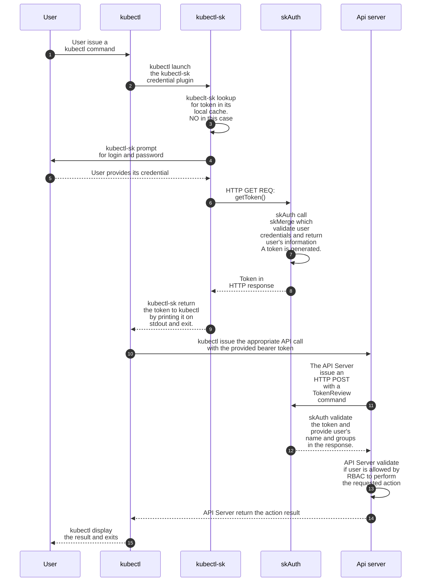
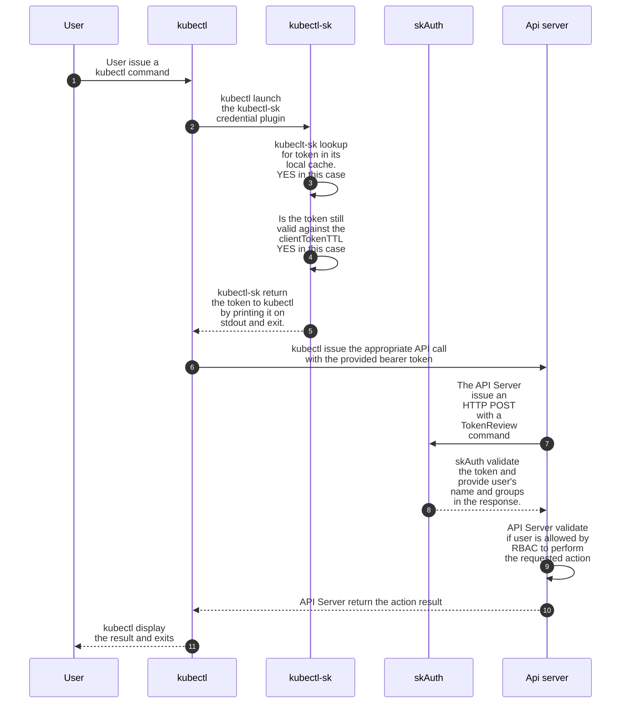
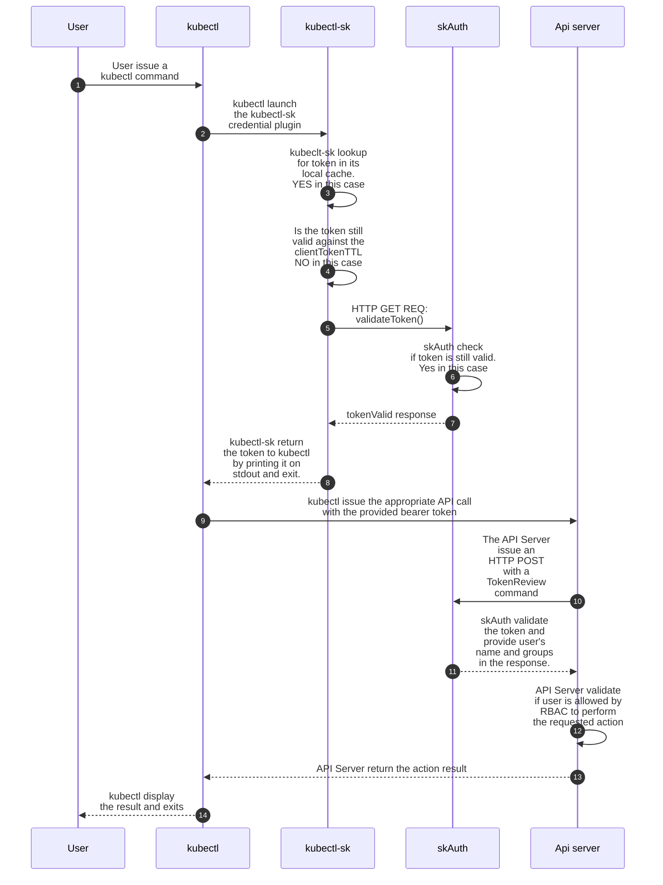
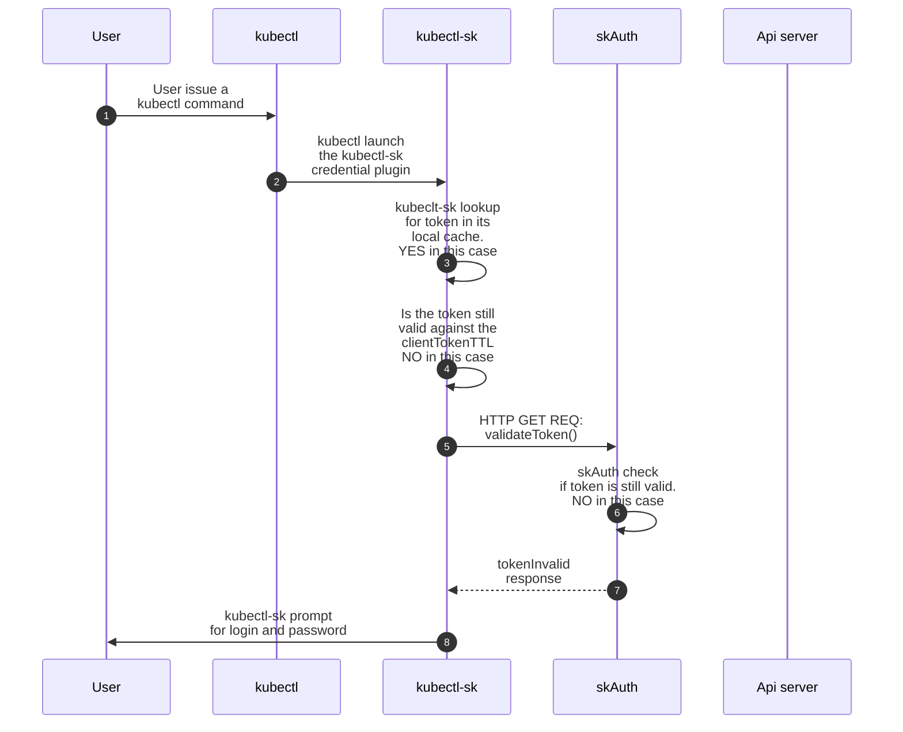

# Architecture

## Overview

Here is the different modules involved for a SKAS authentication, right after installation: 

{ align=left width=350}

SKAS is deployed as a Kubernetes Pod, this pod hosting three containers:

- `skAuth` which is in charge of delivering Kubernetes tokens and validate them.
- `skmerge`, which is in charge of building a consolidated identity from several identity providers. As in this configuration there is a single one, it appact as a simple passthrough
- `skCrd`, which is an identity provider storing user's information in the Kubernetes storage.

Arrow figure out the main communication flow between components. All of them are simple HTTP exchanges.

For clarity, some connection has not been figured in this diagram:

- The `skCrd` module rely on the API server to store its user database, as Custom Resources.
- The `skAuth` module relay on the API server to store active tokens, as Custom Resources.

Here is a summary of exchange for an initial interaction

- The user issue a `kubectl` command (such as `kubectl get pods`). For this, a token is needed. It will be provided by the `kubectl-sk` client-go credential plugins.
- `kubectl-sk` prompt the user for login and password, then issue a `tokenCreate()` request to the `skAuth` module.
- The `skAuth` module issue a `getIdentity()` request with user credential. This request is forwarded to the `skCrd`module.
- The `skCrd` module retrieve user's information, check password validity and send information upward, to the `skMerge` module, which forward them to the `skAuth` module.
- The `skAuth` module generate a token and send it back to the `kubectl-sk` module. Which forward to `kubectl`.
- `kubectl` send the original request with the token to the Kubernetes API server
- The API Server send a `tokenReview()` request to the `skAuth` module, which reply with the user's informations (user id and groups).
- The API Server apply its RBAC rules on user's information to allow or deny requested operation. 

There is a more detailed description of this interaction as [sequence diagram](./architecture.md#sequence-diagrams).

## Sequence diagrams

Here is the sequence for a successful initial connexion.

Here is the sequence when a valid token is already present in client local cache:

Here is the sequence when a token is still valid, but the local cache (which is short lived) has expired:

And here is the sequence when a token has expired:

