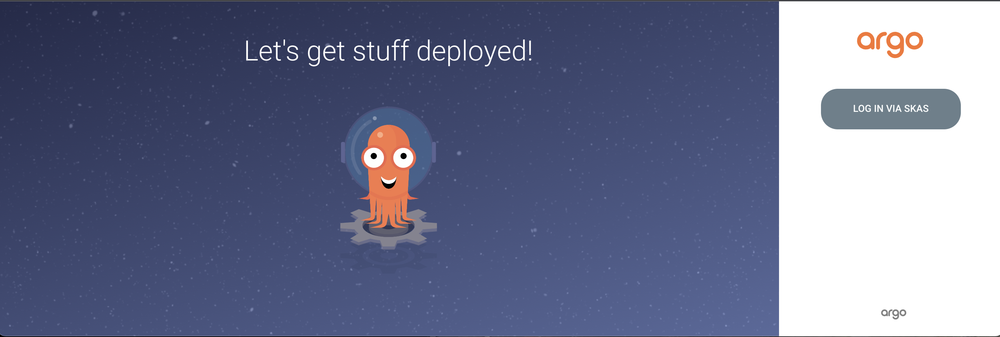
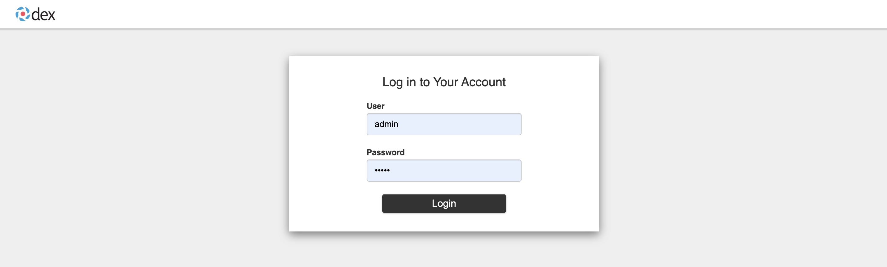
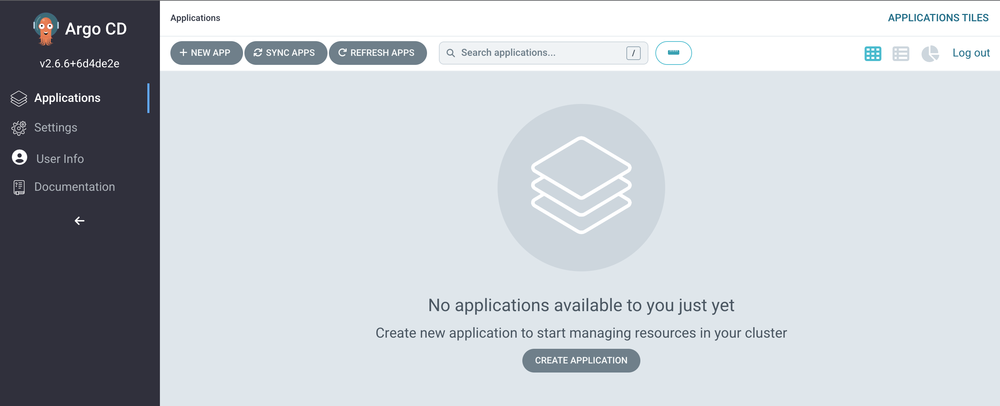
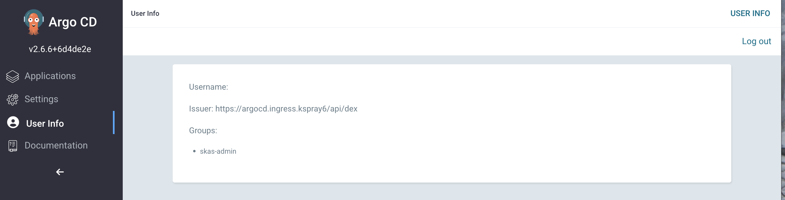

# Argo CD integration with DEX

Argo CD integrates with DEX, embedding an instance of DEX within it. Argo CD takes care of deploying DEX and most of
its configuration. The only part of the DEX configuration that you'll need to set up is the `connectors:` section.

To follow this installation process, it's assumed that you already have an Argo CD instance deployed in a 
'standard' way, complete with a user interface and ingress. Deploying Argo CD in this manner is outside the scope 
of this documentation, so please refer to the Argo CD documentation or use [Argo CD helm chart](https://github.com/argoproj/argo-helm/tree/main/charts/argo-cd).

Once you have Argo CD set up, you should proceed with:

- Deploying SKAS, configuring a `login` service to be used by the embedded DEX instance in Argo CD.
- Configuring this embedded DEX instance by patching the existing deployment."

## SKAS deployment

SKAS needs to be (re)configured to activate a `login` service. Below is the appropriate values file for this configuration:

???+ abstract "values.skas2.yaml"

    ``` { .yaml .copy } 
    skAuth:
      exposure:
        external:
          services:
            login:
              disabled: false
              clients:
                - id: dex-argocd
                  secret: "aSharedSecret"
    ```

Note that client authentication has been set up with a pair of id/secret. 

To apply this configuration:

```{.shell .copy}
helm -n skas-system upgrade -i skas skas/skas --values ./values.init.yaml --values ./values.skas.login.yaml
```

> _Don't forget to include the `values.init.yaml` file or merge it into the `values.skas.yaml` file. Additionally,
if you have other values files, make sure to include them in each upgrade._

> _Also, remember to restart the pod(s) after making these configuration changes. You can find more information on how
to do this in the [Configuration: Pod restart](configuration.md#pod-restart) section._

## Patching argo CD

The next step is to patch the Argo CD deployment. In fact, there are two patches required:

- One to use the SKAS-specific DEX image. DEX does not provide an extension mechanism to add connectors externally, 
so a specific SKAS DEX image with a SKAS connector must be used.
- Another to configure the `configMap` storing the DEX configuration.

Here is the patch file for the DEX image (It is a JSON RFC 6902 Patch):

???+ abstract "dex-server-patch.json"

    ``` { .json .copy } 
    [
      { "op": "replace",
        "path": "/spec/template/spec/containers/0/image",
        "value": "ghcr.io/skasproject/dex:v2.37.0-skas-0.2.2"
      }
    ]
    ```

To apply these patches, use the following command:

```{.shell .copy}
kubectl -n argocd patch deployment argocd-dex-server --type json --patch-file ./dex-server-patch.json
```

Here is the DEX configuration patch (It is a [Strategic Merge patch](https://kubernetes.io/docs/tasks/manage-kubernetes-objects/update-api-object-kubectl-patch/#use-a-strategic-merge-patch-to-update-a-deployment)):

???+ abstract "argocd-cm-patch.yaml"

    ``` { .yaml .copy } 
    data:
      admin.enabled: "false"
      url: https://argocd.ingress.mycluster.internal
      dex.config: |
        connectors:
        - type: skas
          id: skas
          name: SKAS
          config:
            loginPrompt: "User"
            loginProvider:
              url: https://skas-auth.skas-system.svc
              rootCaData: "LS0tLS1CRUdJTiBDRVJUSUZJQ0FURS0......................09Ci0tLS0tRU5EIENFUlRJRklDQVRFLS0tLS0K"
              insecureSkipVerify: false
              clientAuth:
                id: "dex-argocd"
                secret: "aSharedSecret"
    ```

The DEX `connectors:` config is similar to the one in DEX standalone configuration.

You must adjust:

- The `url: https://argocd.ingress.mycluster.internal` to point to your Argo CD server UI.
- The `admin.enabled` if you want to still be able to use the local Argo CD `admin` account.
- The `rootCaData:` field is populated with the Certificate Authority of the `skAuth` kubernetes service. 
  To find its value, you can extract it from the service's certificate.<br>You can retrieve it with the following command:
    ```{ .yaml .copy } 
    kubectl -n skas-system get secret skas-auth-cert -o=jsonpath='{.data.ca\.crt}'
    ```

Then, you must apply this patch using the following command:

```{.shell .copy}
kubectl -n argocd patch configMap argocd-cm --type strategic --patch-file ./argocd-cm-patch.yaml
```

### Restart Pods

For the patch to take effect, you will need to restart some of the Argo CD pods:

```{.shell .copy}
$ kubectl -n argocd rollout restart deployment argocd-dex-server && \
kubectl -n argocd rollout restart deployment argocd-server
```

## Test

Open your browser and navigate to the Argo CD UI. You should see a page similar to this:



Click on the `LOG IN VIA SKAS` button. You should be redirected to the DEX login page. Enter a valid user login and 
password:



And you should land on the usual Argo CD Applications page:



Click on the `User info` menu entry on the left to ensure you have the correct user information:



We can see the groups are correct. The Argo CD web UI chooses to display the user's email in the Username field. If 
our current user has no email defined, the field will appear blank.
