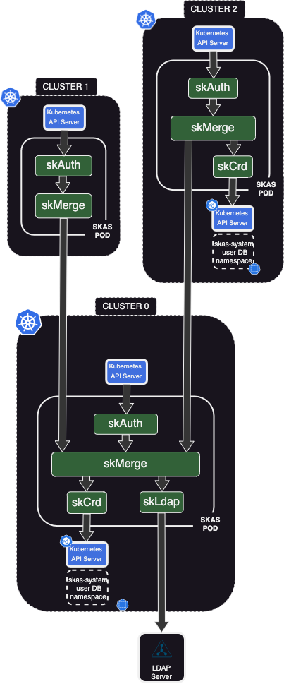

# Cluster federation

{ align=right width=320}

Due to its modular concept and ability to configure links between modules, even across clusters, SKAS is very effective in a multi-cluster environment.

Here a sample configuration to illustrate this.

- `Cluster0` is a kind of 'control' cluster. It act as a 'hub', providing users information in a centralized approach. 
It could be dedicated to this role, or hosting other 'meta' control function. 
- `Cluster1` is a standard cluster, hosting usual workload. It fully rely on `cluster0` for users authentication.
- `Cluster2` is similar to `cluster1`, but is also able to manage some local users and/or groups.

Of course, this is just one example of what could be achieved with SKAS.

> _In the rich Kubernetes ecosystem, there is several solutions such as Submariner, Skupper, Cillium ClusterMesh, 
Liqo, .... aimed to extend the concept of k8s `services` across clusters. Although these can be used in our cases, 
the configuration described here rely on 'pure vanilla', independent Kubernetes clusters._  

{width=700}

## Cluster0 deployment.

Here are two samples of value file for `cluster0`. Without and with external LDAP server.

> The LDAP server will help to illustrate the chaining of provider.

???+ abstract "values.cluster0-noldap.yaml"

    ``` { .yaml .copy }
    clusterIssuer: your-cluster-issuer
    
    skAuth:
      exposure:
        external:
          ingress:
            host: skas.ingress.cluster0
      kubeconfig:
        context:
          name: skas@cluster0
        cluster:
          apiServerUrl: https://kubernetes.ingress.cluster0
     
    skMerge:
      exposure:
        external:
          enabled: true
          services:
            identity:
              disabled: false
              clients:
                - id: cluster1
                  secret: cluster0Cluster1SharedSecret
                - id: cluster2
                  secret: cluster0Cluster2SharedSecret
          ingress:
            enabled: true
            host: skas-skmerge.ingress.cluster0
    ```

The first part include what was in a separate `values.init.yaml` file in other samples of this documentation.
As such, this file can be used for initial deployment, or for upgrading an exiting one.

Then, there is the part specific to this configuration. The [`identiy`](architecture.md#identity_1) service of the 
`skMerge` module is exposed externally. An authentication is required from the callers, which will be the two other clusters.

Also, this service must be accessed externally. So the `ingress.enable: true` and `ingress.host`, which must be adjusted to your context.

> Of course, the `ingress.host` value must also be defined in your DNS.

Here is the values file including the LDAP external server:

??? abstract "values.cluster0-ldap.yaml"

    ``` { .yaml .copy }
    clusterIssuer: your-cluster-issuer
    
    skAuth:
      exposure:
        external:
          ingress:
            host: skas.ingress.cluster0
      kubeconfig:
        context:
          name: skas@cluster0
        cluster:
          apiServerUrl: https://kubernetes.ingress.cluster0
     
    skLdap:
      enabled: true
      # --------------------------------- LDAP configuration
      ldap:
        host: ldap.mydomain.internal
        insecureNoSSL: false
        rootCaData: "LS0tLS1CRUdJTiBDRVJUSUZ................................lRJRklDQVRFLS0tLS0K"
        bindDN: cn=Manager,dc=mydomain,dc=internal
        bindPW: admin123
        groupSearch:
          baseDN: ou=Groups,dc=mydomain,dc=internal
          filter: (objectClass=posixgroup)
          linkGroupAttr: memberUid
          linkUserAttr: uid
          nameAttr: cn
        timeoutSec: 10
        userSearch:
          baseDN: ou=Users,dc=mydomain,dc=internal
          cnAttr: cn
          emailAttr: mail
          filter: (objectClass=inetOrgPerson)
          loginAttr: uid
          numericalIdAttr: uidNumber

    skMerge:
      providers:
        - name: crd
        - name: ldap
      exposure:
        external:
          enabled: true
          services:
            identity:
              disabled: false
              clients:
                - id: cluster1
                  secret: cluster0Cluster1SharedSecret
                - id: cluster2
                  secret: cluster0Cluster2SharedSecret
          ingress:
            enabled: true
            host: skas-skmerge.ingress.cluster0
    ```

Please, refer to [LDAP Setup](ldap.md) for how to configure this external LDAP server connection.

To apply the configuration of your choice, enter: 

```shell
$ helm -n skas-system upgrade -i skas skas/skas --values ./values.cluster0-noldap.yaml --create-namespace
```
with a kubernetes config targeting `cluster0` with administrator privileges:

If this is the first deployment on this cluster, don't forget also to [configure the API Server](installation.md#api-server-configuration)

For the configuration of the two other clusters, you will need the Certificate Authority of ingress on the `skMerge` 
identity endpoint, encoded in base64. You can retrieve it with the following command:

```shell
$ kubectl -n skas-system get secret skas-merge-cert -o=jsonpath='{.data.ca\.crt}'
```

## Cluster1 deployment

Here is a sample of values file for `cluster1` deployment:

???+ abstract "values.cluster1.yaml"

    ``` { .yaml .copy }
    clusterIssuer: your-cluster-issuer
    
    skAuth:
      exposure:
        external:
          ingress:
            host: skas.ingress.cluster1
      kubeconfig:
        context:
          name: cluster1
        cluster:
          apiServerUrl: https://kubernetes.ingress.cluster1
    
    skMerge:
      providers:
        - name: cluster0
    
      providerInfo:
        cluster0:
          url: https://skas-skmerge.ingress.cluster0
          rootCaData: "LS0tLS1CRUdJTiBDRV.............09Ci0tLS0tRU5EIENFUlRJRklDQVRFLS0tLS0K"
          insecureSkipVerify: false
          clientAuth:
            id: cluster1
            secret: cluster0Cluster1SharedSecret
    
    skCrd:
      enabled: false
    ```

Again, the first part include what was in a separate `values.init.yaml` file in other samples of this documentation.
As such, this file can be used for initial deployment, or for upgrading an exiting one.

Then:

- The `skMerge.providers` list contains only one provider: `cluster0`, defined just below it.
- The `providerInfo.cluster0.url` target the ingress we setup on `cluster0` to reach its identity service.
- The `providerInfo.cluster0.rootCaData` is set to the base64 encoded Certificate Authority of ingress on the `skMerge`
identity endpoint. We retrieved this at the end of the previous paragraph.
- The `providerInfo.cluster0.clientAuth` provide authentication information, as required by `cluster0`.

To apply this configuration, enter:

```shell
$ helm -n skas-system upgrade -i skas skas/skas --values ./values.cluster1.yaml --create-namespace
```
with a kubernetes config targeting `cluster1` with administrator privileges:

If this is the first deployment on this cluster, don't forget also to [configure the API Server](installation.md#api-server-configuration)

### Testing

We can now configure our local Kubernetes config file to access to our clusters:

```shell
$ kubectl sk init https://skas.ingress.cluster0
Setup new context 'cluster0' in kubeconfig file '/Users/john/.kube/config'

$ kubectl sk init https://skas.ingress.cluster1
Setup new context 'cluster1' in kubeconfig file '/Users/john/.kube/config'
```

We can connect as `admin` on `cluster0` and check what this user look like:

```shell
$ kubectl config use-context cluster0
Switched to context "cluster0".

$ kubectl sk login admin
Password:
logged successfully..

$ kubectl sk user describe admin --explain
USER    STATUS              UID   GROUPS                          EMAILS           COMMON NAMES               AUTH
admin   passwordUnchecked   0     admin,all,auditors,skas-admin   admin@xxxx.com   SKAS administrator,admin   crd

Detail:
PROVIDER   STATUS              UID    GROUPS               EMAILS           COMMON NAMES
crd        passwordUnchecked   0      skas-admin                            SKAS administrator
ldap       passwordUnchecked   2003   all,auditors,admin   admin@xxxx.com   admin
```

In this example, the user `admin` exists in our both provider (`crd` and `ldap`). Both values are merged to provide the user profile (Refer to [Identity Providers chaining](chaining.md))

Now, we can make the same operation on `cluster1`:

```shell
$ kubectl config use-context cluster1
Switched to context "cluster1".

$ kubectl sk login admin
Password:
logged successfully..

$ kubectl sk user describe admin --explain
USER    STATUS              UID   GROUPS                          EMAILS           COMMON NAMES               AUTH
admin   passwordUnchecked   0     admin,all,auditors,skas-admin   admin@xxxx.com   SKAS administrator,admin   cluster0

Detail:
PROVIDER   STATUS              UID   GROUPS                          EMAILS           COMMON NAMES
cluster0   passwordUnchecked   0     admin,all,auditors,skas-admin   admin@xxxx.com   SKAS administrator,admin
```

From the `cluster1` point of view, we have only one provider: `cluster0`. We hide the information about how the `admin` profile was build.

> _If we want to expose this information, we can refactor this configuration by connecting `cluster1.skMerge` directly to the `cluster0` identity providers (`crd` and `ldap`), a level below `skMerge`._

Now, let's try to create a new user on `cluster1`:

```shell
$ kubectl config use-context cluster1
Switched to context "cluster1".

$ kubectl sk whoami
USER    ID   GROUPS
admin   0    admin,all,auditors,skas-admin

$ kubectl sk user create localuser1 --generatePassword
ERRO[0000] API server communication error                error="users.userdb.skasproject.io \"localuser1\" is forbidden: User \"admin\" cannot get resource \"users\" in API group \"userdb.skasproject.io\" in the namespace \"skas-system\""
```

The operation fail, as the `admin` user have not rights to write the the `skas-system` namespace of the `cluster1`. 
This is the intended behavior, as we want users definition to exists only in `cluster0`.

There is a case where this operation seems to work: If your `admin` user is also kubernetes administrator 
(i.e member of `system:masters`), it will be able to write to the `skas-system` namespace, so the creation will be successful.
But, **the users created this way will not be taken in account by the system**, as there is no `crd` provider in `cluster1`. Same for `GroupBindinds`

```shell
$  kubectl config use-context cluster0
Switched to context "cluster0".

$ kubectl sk user bind admin system:masters
GroupBinding 'admin.system.masters' created in namespace 'skas-system'.

$ kubectl config use-context cluster1
Switched to context "cluster1".

$ kubectl sk login admin
Password:
logged successfully..

$ kubectl sk whoami
USER    ID   GROUPS
admin   0    admin,all,auditors,skas-admin,system:masters

$ kubectl sk user create localuser1 --generatePassword
The following password has been generated: 'KTeZrzYEgeHS'
(Save it as it will not be accessible anymore).
User 'localuser1' created in namespace 'skas-system'.

$ kubectl sk login localuser1 KTeZrzYEgeHS
Invalid login!
```

## Cluster2 deployment

Here is a sample of values file for `cluster2` deployment:

???+ abstract "values.cluster1.yaml"

    ``` { .yaml .copy }
    clusterIssuer: cluster-issuer1
    
    skAuth:
      exposure:
        external:
          ingress:
            host: skas.ingress.cluster2
      kubeconfig:
        context:
          name: cluster2
        cluster:
          apiServerUrl: https://kubernetes.ingress.cluster2
    
      # Members of these group will be allowed to perform 'kubectl-sk user describe'
      # Also, they will be granted by RBAC to access token resources
      adminGroups:
        - skas-admin
        - cluster2-skas-admin
    
    skMerge:
      providers:
        - name: cluster0
        - name: crd
    
      providerInfo:
        cluster0:
          url: https://skas-skmerge.ingress.cluster0
          rootCaData: "LS0tLS1CRUdJTiBDRVJUSUZJQ0FURS...........VNGelVDQT09Ci0tLS0tRU5EIENFUlRJRklDQVRFLS0tLS0K"
          insecureSkipVerify: false
          clientAuth:
            id: cluster2
            secret: cluster0Cluster2SharedSecret
    
    skCrd:
      enabled: true
    
      initialUser:
        login: cluster2-skas-admin
        passwordHash: $2a$10$ijE4zPB2nf49KhVzVJRJE.GPYBiSgnsAHM04YkBluNaB3Vy8Cwv.G  # admin
        commonNames: ["Cluster2 SKAS administrator"]
        groups:
          - cluster2-skas-admin
    
      # Members of theses groups will be granted RBAC access to users and groupBinding resources in the namespace above
      adminGroups:
        - cluster2-skas-admin
        - skas-admin
    ```


Again, the first part include what was in a separate `values.init.yaml` file in other samples of this documentation.
As such, this file can be used for initial deployment, or for upgrading an exiting one.

Then:

- `skMerge.providers` reference now our local `crd` providers aside the global `cluster0`.
- `skMerge.providerInfo.cluster0` is the same as for `cluster1`, except of course the `clientAuth` part.
- An initial user (`cluster2-skas-system`) is created as local admin. This account will only be valid on this cluster.
- The list of `adminGroups` must be defined twice:
    - One in the `skAuth` module. This to allow `kubectl-sk user describe` command for members of these groups. 
    - One in the `skCrd` module. This to setup RBAC rules to allow SKAS resources (skusers, groupBindings, tokens) to be managed by members of theses groups.

To apply this configuration, enter:

```shell
$ helm -n skas-system upgrade -i skas skas/skas --values ./values.cluster2.yaml --create-namespace
```
with a kubernetes config targeting `cluster2` with administrator privileges:

If this is the first deployment on this cluster, don't forget also to [configure the API Server](installation.md#api-server-configuration)

### Testing

Configure our local Kubernetes config file to access to this clusters:

```shell
$ kubectl sk init https://skas.ingress.cluster2
Setup new context 'cluster2' in kubeconfig file '/Users/john/.kube/config'
```

Now, we can log as local admin, and describe ourself:

```shell
$ kubectl sk login cluster2-skas-admin
Password:
logged successfully..

$ kubectl sk user describe cluster2-skas-admin --explain
USER                  STATUS              UID   GROUPS                EMAILS   COMMON NAMES                  AUTH
cluster2-skas-admin   passwordUnchecked   0     cluster2-skas-admin            Cluster2 SKAS administrator   crd

Detail:
PROVIDER   STATUS              UID   GROUPS                EMAILS   COMMON NAMES
cluster0   userNotFound        0
crd        passwordUnchecked   0     cluster2-skas-admin            Cluster2 SKAS administrator
```

Ensure we can perform all usual user management operations under this account:

```shell
$ kubectl -n skas-system get tokens
NAME                                               CLIENT   USER LOGIN            AUTH.   USER ID   CREATION               LAST HIT
tjvygwmtparktpwiiuysydzctbunppkycsykprtdswsramtm            cluster2-skas-admin   crd     0         2023-08-31T12:43:03Z   2023-08-31T12:43:26Z

$ kubectl sk user create cluster2user1 --generatePassword
The follwing password has been generated: '8fJoM6JFObjO'
(Save it as it will not be accessible anymore).
User 'cluster2user1' created in namespace 'skas-system'.

$  kubectl sk user bind cluster2user1 cluster2grp1
GroupBinding 'cluster2user1.cluster2grp1' created in namespace 'skas-system'.

$ kubectl sk user describe cluster2user1
USER            STATUS              UID   GROUPS         EMAILS   COMMON NAMES   AUTH
cluster2user1   passwordUnchecked   0     cluster2grp1                           crd

$ kubectl sk user describe cluster2user1 --explain
USER            STATUS              UID   GROUPS         EMAILS   COMMON NAMES   AUTH
cluster2user1   passwordUnchecked   0     cluster2grp1                           crd

Detail:
PROVIDER   STATUS              UID   GROUPS         EMAILS   COMMON NAMES
cluster0   userNotFound        0
crd        passwordUnchecked   0     cluster2grp1
```

And check the newly created user is effective:

```shell
$ kubectl sk login cluster2user1 8fJoM6JFObjO
logged successfully..

$ kubectl sk whoami
USER            ID   GROUPS
cluster2user1   0    cluster2grp1

$ kubectl get ns
Error from server (Forbidden): namespaces is forbidden: User "cluster2user1" cannot list resource "namespaces" in API group "" at the cluster scope
```

> _The same operations can be performed under the `admin` account. This because it is member of the `skas-admin` group 
and we choose to include this group in the two `adminGroups` list in the `values.cluster2.yaml` configuration file._
