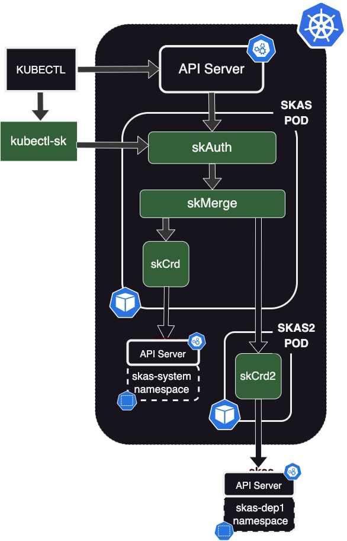

# Delegated users management

Aim of this configuration is the ability to delegate the management of a certain set of users and/or their group bindings.

But, we want to restrict the rights of the administrator of the delegated space. Especially , we don't want them to be able to promote themself to global system administrator.


{ align=right width=350}

In this sample configuration, we will setup a separate user database for a department 'dep1'.

To achieve this, the solution is to create a specific namespace `dep1-userdb` which will host `skusers` and `groupBinding` SKAS resources

And to handle this namespace, we need to instantiate a second Identity Provider, of type skCrd.

For the reasons described in [Adding as second LDAP Server](#adding-a-second-ldap-server), we need to instantiate this POD as a separate Helm deployment, thus using the same Helm Chart

This configuration requires two steps:

- Setup a new Helm deployment for `skLdap2` pod.
- Reconfigure the `skMerge` module of the main SKAS pod to connect to this new IDP.

{width=700}

In the following, three variants of this configuration will be described. One with the connection in clear text, and two secured, with network encryption and inter-pod authentication.

## Clear text connection

### Auxiliary POD configuration

Here is a sample values file to configure the auxiliary POD:

??? abstract "values.skCrd2.yaml"

    ``` { .yaml .copy }
    skAuth:
      enabled: false
    ```

At the beginning of the file, we disable all other modules than `skLdap`.

Then there is the connection to the second LDAP server which must be adjusted to your context. Refer to [LDAP Setup](./ldap.md)

Then, there is the `exposure` part, who define how this service will be exposed. (The default configuration is expose to `localhost` in clean text)

- `exposure.internal.enabled: false` shutdown the HTTP server bound on localhost.
- `exposure.external.enabled: true` set the HTTP server bound on the POD IP up. This on port 7113 with no SSL.
- Then the is the configuration of the `identity` service to expose:
    - `clients[]` is a mechanism to validate who is able to access this service, by providing an `id` and a `secret`
      (or password). the values "*" will disable this feature.
    - `protected: true` activate an internal mechanism against attacks of type 'Brut force', by introducing delays on
      unsuccessful connection attempts, and by limiting the number of simultaneous connections. There is no reason to
      disable it, except if you suspect a misbehavior.

To deploy this configuration:

```shell
helm -n skas-system install skas2 skas/skas --values ./values.ldap2.yaml
```

> **Note the `skas2' release name**

The Helm chart will deploy the new pod(s), under the name `skas2`. it will also deploy an associated Kubernetes `service`.

### Main pod reconfiguration

Second step is to reconfigure the main POD

Here is a sample of appropriate configuration:

??? abstract "values.main.yaml"

    ``` { .yaml .copy }
    skMerge:
      providers:
        - name: crd
        - name: ldap1
          groupPattern: "dep1_%s"
        - name: ldap2
          groupPattern: "dep2_%s"
    ```

There is two entries aimed to configure a provider on the bottom of the `skMerge` module:

- `providers` is a list of the connected providers, which allow to define their behavior. The order is important here.
  Refers to the [IDP chaining: Provider configuration](chaining.md#provider-configuration) chapter.
- `providerInfo` is a map providing information on how to reach these providers.<br>For `crd` and `ldap1`, we use the
  default `localhost` port.<br>For `ldap2` we use the service created by the `skas2` deployment.

The link between these two entries is of course the provider name.

Then there is the configuration for the primary LDAP server, which must be adapted to your configuration.

Then, the reconfiguration must be applied:

```shell
$ helm -n skas-system upgrade skas skas/skas --values ./values.init.yaml \
--values ./values.ldap1and2.yaml
```

> _Don't forget to add the `values.init.yaml`, or to merge it in the `values.ldap.yaml` file. Also, if you have others values file, they must be added on each upgrade_

> _And don't forget to restart the pod(s). See [Configuration: Pod restart](configuration.md/#pod-restart)_

If deploying two separate Charts is a constraint for you, you may setup a 'meta chart'. See [here](/toolsandtricks#tricks-setup-a-meta-helm-chart)

## Test

Then, you can test your configuration:


## Securing connection

It should ne noted than unencrypted passwords will transit through the link between the two pods. So, setting up encryption is a must have.

### Auxiliary POD configuration

Here is the modified version for the `skLdap2` pod configuration:

??? abstract "values.skCrd2.yaml"

    ``` { .yaml .copy }
    skAuth:
      enabled: false
    ```

The differences are the following:

- There is a `clusterIssuer` definition to be able to generate a certificate. (It is assumed here than `cert-manager` is deployed in the cluster)
- `exposure.external.ssl` is set to `true`. This will also leads the generation of the server certificate.
- The `service.identity.clients` authentication is also activated. The `id` and `secret` values will have to be provided by the `skMerge` client.

To deploy this configuration:

```shell
helm -n skas-system install skas2 skas/skas --values ./values.ldap2.yaml
```

> **Note the `skas2' release name**

The Helm chart will deploy the new pod(s), under the name `skas2`. it will also deploy an associated Kubernetes `service`
and the `cert-manager.io/v1/Certificate` request.

### Main pod reconfiguration

Here is the modified version for the main SKAS POD configuration:

??? abstract "values.main.yaml"

    ``` { .yaml .copy }
    skMerge:
      providers:
        - name: crd
        - name: ldap1
          groupPattern: "dep1_%s"
        - name: ldap2
          groupPattern: "dep2_%s"
    ```

The `providerInfo.ldap2` has been modified for SSL and authenticated connection:

- `url` begins with `https`.
- `clientAuth` provides information to authenticated against the `skLdap2` pod.
- `insecureSkipVerify` is set to false, as we want to check certificate validity.
- `rootCaPath` is set to access the `ca.crt`, the CA validating the `skLdap2` server certificate.

As stated above, during the deployment of the `skLdap2` auxiliary POD, a server certificate has been generated to allow
SSL enabled services. This certificate is stored in a secret (of type `kubernetes.io/tls`) named `skas2-ldap-cert`.
Alongside the private/public key pair, it also contains the root Certificate authority under the name`ca.crt`.

The `skMerge.extraSecrets` subsection instruct the POD to mount this secret to the defined location.
The property `skMerge.providerInfo.ldap2.rootCaPath` can now refer to the mounted value.

Then, the reconfiguration must be applied:

```shell
$ helm -n skas-system upgrade skas skas/skas --values ./values.init.yaml \
--values ./values.ldap1and2.yaml
```

> _Don't forget to add the `values.init.yaml`, or to merge it in the `values.ldap.yaml` file. Also, if you have others values file, they must be added on each upgrade_

> _And don't forget to restart the pod(s). See [Configuration: Pod restart](configuration.md/#pod-restart)_

You can now test again your configuration, as [described above](#test)

## Use a Kubernetes secrets

There is still a security issue, as the shared secret (`aSharedSecret`) is in clear text in both values file. As such it may ends up in some version control system.

The good practice will be to store the secret value in a kubernetes `secret` resource, such as:

``` { .yaml .copy }
---
apiVersion: v1
kind: Secret
metadata:
  name: ldap2-client-secret
  namespace: skas-system
data:
  clientSecret: Sk1rbkNyYW5WV1YwR0E5
type: Opaque
```

Where `data.clientSecret` is the secret encoded in base 64.

> There is several solution to generate such secret value. One can use Helm with some random generator function. Or use a [Secret generator](/toolsandtricks#secret-generator)

### Auxiliary POD configuration

To use this secret, here is the new modified version for the `skLdap2` POD configuration:

??? abstract "values.skCrd2.yaml"

    ``` { .yaml .copy }
    skAuth:
      enabled: false
    skMerge:
      enabled: false
    skCrd:
      enabled: false
    ```

The modifications are the following:

- The `skLdap.extraEnv` subsection inject the secret value as an environment variable in the container.
- the `exposure.external.services.identity.clients[0].secret` fetch its value through this environment variable.

> Most of the values provided by the helm chart ends up inside a configMap, which is then loaded by the SKAS executable. The environment variable interpolation occurs during this load.

### Main pod reconfiguration

Here is the modified version, with `secret` handling, for the main SKAS pod configuration:

??? abstract "values.main.yaml"

    ``` { .yaml .copy }
    skMerge:
      providers:
        - name: crd
        - name: ldap1
          groupPattern: "dep1_%s"
        - name: ldap2
          groupPattern: "dep2_%s"
    ```

The modifications are the same as the SKAS2 POD


