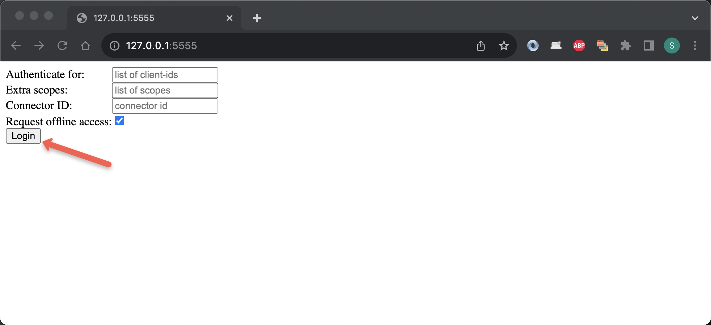
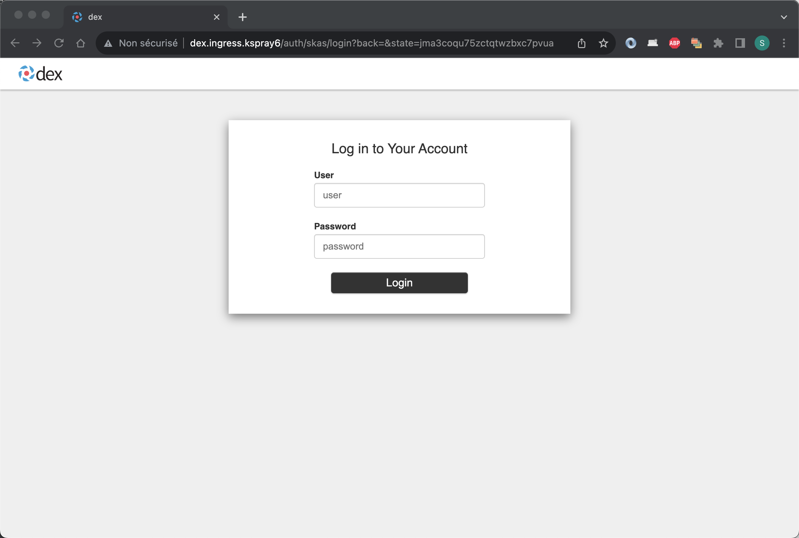

# DEX integration

[DEX](https://dexidp.io/) is an OpenID Connect provider. As such, it will serve OpenID Connect clients to provide Single Sign-On services.

DEX does not host any user identity information by itself but relies on other Identity Providers for this through configurable `connectors`.

A connector has been developed for SKAS. As DEX does not provide an extension mechanism, adding a connector requires 
patching the code. So, a specific DEX image with a SKAS connector has been built.

Deploying DEX in standalone mode requires two operations:

- Reconfiguring SKAS to open a service for the usage of DEX (the `login` service).
- Deploying DEX itself with the proper connector configuration.

In the following, three variants of this configuration will be described. One with the connection in clear text, and two secured, with network encryption and inter-pod authentication.

> _Even if your target is a fully secured configuration, we suggest you first implement the unsecured, simplest variant, and then modify it incrementally, as described._

## Clear text connection

### SKAS reconfiguration

The `login` service is provided by the `skAuth` module in SKAS. By default, this service is disabled and must be 
enabled to be used. You can find more information about SKAS modules and interfaces in the 
[Architecture/Modules and interface](architecture.md#modules-and-interfaces) section.

Below is a sample values file that enables the login service:

???+ abstract "values.skas.login.yaml"

    ``` { .yaml .copy } 
    skAuth:
      exposure:
        external:
          services:
            login:
              disabled: false
    ```

Please note that by default, the `skAuth` module provides only SSL-encrypted services. This includes our login service.

To deploy this configuration:

```{.shell .copy}
helm -n skas-system upgrade -i skas skas/skas --values ./values.init.yaml --values ./values.skas.login.yaml
```

> _Don't forget to include the `values.init.yaml` file or merge it into the `values.skas.yaml` file. Additionally,
if you have other values files, make sure to include them in each upgrade._

> _Also, remember to restart the pod(s) after making these configuration changes. You can find more information on how
to do this in the [Configuration: Pod restart](configuration.md#pod-restart) section._

### DEX deployment

For this example, we will use the official [DEX Helm chart](https://github.com/dexidp/helm-charts/tree/master/charts/dex). 
However, this will require some configuration adjustments by providing a specific value file.

Here is such sample file (Please note that some values may need to be customized to match your specific context):

??? abstract "values.dex.yaml"

    ``` { .yaml .copy } 
    image:
      repository: ghcr.io/skasproject/dex
      tag: v2.37.0-skas-0.2.2
    
    config:
      issuer: http://dex.ingress.mycluster.internal
      storage:
        type: kubernetes
        config:
          inCluster: true
      web:
        http: 0.0.0.0:5556
      logger:
        level: info
        format: text
      oauth2:
        skipApprovalScreen: true
      connectors:
        - type: skas
          id: skas
          name: SKAS
          config:
            loginPrompt: "User"
            loginProvider:
              url: https://skas-auth.skas-system.svc
              insecureSkipVerify: true
    
      staticClients:
        - id: example-app
          redirectURIs:
            - 'http://127.0.0.1:5555/callback'
          name: 'Example App'
          secret: ZXhhbXBsZS1hcHAtc2VjcmV0
    
    securityContext:
      allowPrivilegeEscalation: false
      capabilities:
        drop:
          - ALL
      readOnlyRootFilesystem: false
      runAsNonRoot: true
      runAsUser: 1000
      seccompProfile:
        type: RuntimeDefault
    
    ingress:
      enabled: true
      className: nginx
      hosts:
        - host: dex.ingress.mycluster.internal
          paths:
            - path: /
              pathType: ImplementationSpecific
              backend:
                service:
                  name: dex
                  port:
                    number: 5556
    ```

Here are some comments about this values file:

- The `image` section is used to specify the SKAS patched image of DEX.
- The `config` section represents the DEX configuration file. For a more detailed explanation, please refer to the
  [sample DEX config file](https://github.com/dexidp/dex/blob/master/examples/config-dev.yaml).
- The `config.issuer` value needs to be adjusted according to your local domain name. Note that it is an unsecured URL.
- The `config.connnectors[0]` is the SKAS specific section. 
- The `config.connnectors[0].config.loginProvider.url` value points to the `skAuth` service. As mentioned earlier, 
  this service uses SSL encryption
- The `config.connnectors[0].config.loginProvider.insecureSkipVerify` is set to `true`. This is because the targeted 
  service uses HTTPS, and we're skipping the certificate authority validation for this first sample.
- the `staticClients` section defines a first OIDC client with parameters compatible with the `example-app` described below. 
- The `securityContext` section specifies some security constraints. This can be useful if your cluster enforces
  security restrictions on running PODs.
- The `ingress` section should be adjusted, especially for the `host:` URL, and possibly more if you're using an 
 ingress controller other than nginx.  

This will add the DEX Helm chart repository to your Helm configuration and update the list of available charts. 

```{.shell .copy}
helm repo add dex https://charts.dexidp.io
helm repo update
```

Now you can proceed to deploy DEX using Helm with the provided values file.

```{.shell .copy}
helm -n skas-system upgrade -i dex dex/dex --values ./values.dex.yaml
```

f everything is set up correctly, you should have two running Pods:

```shell
$ kubectl -n skas-system get pods
> NAME                    READY   STATUS    RESTARTS   AGE
> dex-54b4698bcd-9wbz6    1/1     Running   0          5h5m
> skas-5cc75b8ff9-pw7nd   3/3     Running   0          6h23m
```

In case of problems, you may want to check the resulting configuration. Unfortunately, this Helm chart stores it in a 
secret. This means the configuration values are encoded in base64.

To display it, you can use the following command:

```{.shell .copy}
kubectl get secret -n skas-system dex -o jsonpath="{ $.data.config\.yaml }" | base64 -d
```

If you modify some value in the `values.skas.login.yaml` file, execute again the Helm deployment command and 
restart the DEX Pod:

```{.shell .copy}
helm -n skas-system upgrade -i dex dex/dex --values ./values.dex.yaml
kubectl -n skas-system rollout restart deployment dex
```

### Testing

By convention, all OIDC providers must provide a `well-known` endpoint that describes their other endpoints and 
configuration values. 

You can test this endpoint with the following command:

```shell
$ curl http://dex.ingress.mycluster.internal/.well-known/openid-configuration
> {
>   "issuer": "http://dex.ingress.mycluster.internal",
>   "authorization_endpoint": "http://dex.ingress.mycluster.internal/auth",
>   "token_endpoint": "http://dex.ingress.mycluster.internal/token",
>   "jwks_uri": "http://dex.ingress.mycluster.internal/keys",
>   ....
```

> _Of course, you must adjust the URL to match your specific context_

Running the provided command will help ensure that DEX is up and running and that your ingress configuration 
is functional.

To delve deeper, DEX provides a raw [example-app](https://github.com/dexidp/dex/tree/master/examples/example-app). 
The primary objective of this application is to offer a starting point for developers to integrate an OIDC client into 
their code. However, it also provides an interactive tool for testing an OIDC service.

For your convenience, we have set up a repository to host 
[binaries of this application](https://github.com/skasproject/dex-example-app/releases/tag/2.37.0) for various 
operating systems and processors.

For instance, to download and install this binary on a Mac Intel:

```{.shell .copy}
cd /tmp
curl -L https://github.com/skasproject/dex-example-app/releases/download/2.37.0/example-app_2.37.0_darwin_amd64 -o ./example-app
sudo chmod 755 example-app
sudo mv example-app /usr/local/bin
```

Then, you can launch it with the DEX issuer URL:

```shell
$ example-app --issuer  http://dex.ingress.mycluster.internal
> 2023/08/28 18:50:07 listening on http://127.0.0.1:5555
```

Now, launch your browser and navigate to the provided link (http://127.0.0.1:5555). You should land on a page like this:



Click on the `Login` button. You should then be directed to a login page:



Enter the credentials of a valid SKAS user account (e.g., 'admin'), and you should be directed to a page like this:


This is not really 'user-friendly', but it is a test application.

You can take a look at the logs for both SKAS and DEX.

You can also test an invalid login.

> _To ensure this works correctly, you must maintain the configuration of `staticClients` in the DEX config file intact._

The DEX GitHub repo also provides the `example-app` as a container. You can launch it using the following command:"

```shell
$ docker run -p 5555:5555 ghcr.io/dexidp/example-app:latest  example-app --issuer  http://dex.ingress.mycluster.internal --listen http://0.0.0.0:5555
> 2023/08/28 17:29:04 listening on http://0.0.0.0:5555
```

## Securing connection

The previous configuration has a significant security issue: The login and password information are transmitted over 
an unencrypted connection.

The following configuration aims to address this vulnerability by implementing secure communication between user's
browser and DEX. It also add authentication from DEX to SKAS. Additionally, it verifies the authenticity of the SKAS certificate."

### SKAS reconfiguration

The following is the modified values file for SKAS reconfiguration:

???+ abstract "values.skas.login.yaml"

    ``` { .yaml .copy } 
    skAuth:
      exposure:
        external:
          services:
            login:
              disabled: false
              clients:
                - id: dex
                  secret: "aSharedSecret"
    ```

The `service` authentication has been activated.

To deploy this configuration, use the same command as previously:

```{.shell .copy}
helm -n skas-system upgrade -i skas skas/skas --values ./values.init.yaml --values ./values.skas.login.yaml
```

> _Don't forget to include the `values.init.yaml` file or merge it into the `values.skas.yaml` file. Additionally,
if you have other values files, make sure to include them in each upgrade._

> _Also, remember to restart the pod(s) after making these configuration changes. You can find more information on how
to do this in the [Configuration: Pod restart](configuration.md#pod-restart) section._

### DEX deployment

And here is the modified values file for DEX deployment

??? abstract "values.dex.yaml"

    ``` { .yaml .copy }     
    image:
      repository: ghcr.io/skasproject/dex
      tag: v2.37.0-skas-0.2.2
    
    config:
      issuer: https://dex.ingress.mycluster.internal
      storage:
        type: kubernetes
        config:
          inCluster: true
      web:
        http: 0.0.0.0:5556
      logger:
        level: info
        format: text
      oauth2:
        skipApprovalScreen: true
      connectors:
        - type: skas
          id: skas
          name: SKAS
          config:
            loginPrompt: "User"
            loginProvider:
              url: https://skas-auth.skas-system.svc
              rootCaPath: ""
              rootCaData: "LS0tLS1CRUdJTiBDRVJU.......................ENFUlRJRklDQVRFLS0tLS0K"
              insecureSkipVerify: false
              clientAuth:
                id: "dex"
                secret: "aSharedSecret"
    
      staticClients:
        - id: example-app
          redirectURIs:
            - 'http://127.0.0.1:5555/callback'
          name: 'Example App'
          secret: ZXhhbXBsZS1hcHAtc2VjcmV0
    
    securityContext:
      allowPrivilegeEscalation: false
      capabilities:
        drop:
          - ALL
      readOnlyRootFilesystem: false
      runAsNonRoot: true
      runAsUser: 1000
      seccompProfile:
        type: RuntimeDefault
    
    ingress:
      enabled: true
      className: nginx
      annotations:
        cert-manager.io/cluster-issuer: your-cluster-issuer
        nginx.ingress.kubernetes.io/force-ssl-redirect: "true"
      hosts:
        - host: dex.ingress.mycluster.internal
          paths:
            - path: /
              pathType: ImplementationSpecific
      tls:
        - secretName: dex-server-tls
          hosts:
            - dex.ingress.kspray6
    ```

The modification are the following:

- The `config.issuer` endpoint now uses HTTPS.
- The `config.connectors[0].config.loginProvider.rootCaData` is populated with the Certificate Authority of the
 `skAuth` service. To obtain its value, you can extract it from the service's certificate as follows:
  ```{.shell .copy }
  kubectl -n skas-system get secret skas-auth-cert -o=jsonpath='{.data.ca\.crt}'
  ```
- The `config.connectors[0].config.loginProvider.clientAuth` is configured to authenticate using the ID/secret defined 
  earlier for the `skAuth` login service.
- The `ingress` is now configured to handle SSL connections and enforce SSL for non-SSL connections.- 

To apply this new configuration, use the same command as before.

```{.shell .copy }
helm -n skas-system upgrade -i dex dex/dex --values ./values.dex.yaml
```

And restart the DEX POD:

```{.shell .copy }
kubectl -n skas-system rollout restart deployment dex
```

> Another security enhancement involves configuring the ingress for SSL passthrough and enabling SSL for the DEX 
Pod itself. This would ensure end-to-end encryption. However, please note that achieving this configuration with the 
current DEX Helm Chart is not feasible, and refactoring it is beyond the scope of this documentation."

### Testing

You can test again the DEX `well-known` endpoint with the following command. Note the https:// now on URLs
You can test the DEX `well-known` endpoint again using the following command.

```shell
$ curl https://dex.ingress.mycluster.internal/.well-known/openid-configuration
> {
>   "issuer": "https://dex.ingress.mycluster.internal",
>   "authorization_endpoint": "https://dex.ingress.mycluster.internal/auth",
>   "token_endpoint": "https://dex.ingress.mycluster.internal/token",
>   "jwks_uri": "https://dex.ingress.mycluster.internal/keys",
>   "userinfo_endpoint": "https://dex.ingress.mycluster.internal/userinfo", 
>   ....
```

> Please note the change to https:// in the URLs."

Use the `example-app` application again, but this time note the 'https://' in the issuer.

```shell
$ example-app --issuer  https://dex.ingress.mycluster.internal
> 2023/08/28 18:50:07 listening on http://127.0.0.1:5555
```

### Encountering a certificate issue? 

You might see the following error on the curl request:

```{.shell}
$ curl https://dex.ingress.mycluster.internal/.well-known/openid-configuration
> curl: (60) SSL certificate problem: unable to get local issuer certificate
> More details here: https://curl.haxx.se/docs/sslcerts.html
> ....
```

This issue occurs when the DEX issuer's certificate is signed by an authority that your workstation don't recognize. 

To resolve this, you need to retrieve the issuer's certificate:

```{.shell .copy}
kubectl -n skas-system get secret dex-server-tls -o=jsonpath='{.data.ca\.crt}' | base64 -d >./CA.crt
```

And to provide it to the Curl command:

```shell
$ curl https://dex.ingress.mycluster.internal/.well-known/openid-configuration \
--cacert ./CA.crt
> {
>   "issuer": "https://dex.ingress.mycluster.internal",
>   "authorization_endpoint": "https://dex.ingress.mycluster.internal/auth",
>   "token_endpoint": "https://dex.ingress.mycluster.internal/token",
>   "jwks_uri": "https://dex.ingress.mycluster.internal/keys",
>   "userinfo_endpoint": "https://dex.ingress.mycluster.internal/userinfo", 
>   ....
```

You may encounter the same issue with the `example-app` test application. In this case, also provide the certificate:

```shell
$ example-app --issuer https://dex.ingress.kspray6 --issuer-root-ca ./CA.crt
> 2023/08/29 09:31:53 listening on http://127.0.0.1:5555
```

## Using a Kubernetes secret

There is still a security issue as two shared secrets (aSharedSecret and the staticClients secret) 
are stored in plain text in both values files. As a result, they could potentially end up in a version control system.

So, let's store these values in Kubernetes secrets and access them using environment variables.

Here is a secret intended to be shared between DEX and SKAS. Its value can be randomly generated, as it is accessed by both parties.

???+ abstract "dex-client-secret.yaml"

    ``` { .yaml  .copy}
    apiVersion: v1
    kind: Secret
    type: Opaque
    metadata:
      name: dex-client-secret
      namespace: skas-system
    data:
      DEX_CLIENT_SECRET: cGZRM3lXSTBBN2M3aGJE
    ```

> There are several solutions to generate such a secret value. One can use Helm with some random generator function or use a [Secret generator](toolsandtricks.md#secret-generator)."

Here is the secret shared between DEX (in `config.staticClients[0]`) and the `example-app` application binary."

???+ abstract "example-app-secret.yaml"

    ``` { .yaml  .copy}
    apiVersion: v1
    kind: Secret
    type: Opaque
    metadata:
      name: example-app-secret
      namespace: skas-system
    data:
      EXAMPLE_APP_SECRET: WlhoaGJYQnNaUzFoY0hBdGMyVmpjbVYw    # Result of printf "ZXhhbXBsZS1hcHAtc2VjcmV0" | base64
    ```

> _Its value is hard-coded in `example-app`, so it must not be changed (or you must pass the new value as the `--client-secret parameter` on launch)._

> _Note that both secrets are formatted in a way that is compatible with `spec.containers[X].envFrom`. This is required by the DEX Helm chart._


### SKAS reconfiguration

Here is the modified values file for the SKAS reconfiguration:

??? abstract "values.skas.login.yaml"

    ``` { .yaml  .copy}
    skAuth:
      exposure:
        external:
          services:
            login:
              disabled: false
              clients:
                - id: dex
                  secret: ${DEX_CLIENT_SECRET}
    
      extraEnv:
        - name: DEX_CLIENT_SECRET
          valueFrom:
            secretKeyRef:
              name: dex-client-secret
              key: DEX_CLIENT_SECRET
    ```

The modifications are the following:

- The `skAuth.extraEnv` subsection injects the secret value as an environment variable in the container.
  The `skAuth.exposure.external.services.identity.clients[0].secret` fetches its value through this environment variable.

> _Most of the values provided by the Helm chart end up inside a `configMap`, which is then loaded by the SKAS 
executable. The environment variable interpolation occurs during this load._

### DEX deployment

Here is the modified values file for DEX deployment:

??? abstract "values.dex.yaml"

    ``` { .yaml  .copy}
    image:
      repository: ghcr.io/skasproject/dex
      tag: v2.37.0-skas-0.2.2
    
    config:
      issuer: https://dex.ingress.mycluster.internal
      storage:
        type: kubernetes
        config:
          inCluster: true
      web:
        http: 0.0.0.0:5556
      logger:
        level: info
        format: text
      oauth2:
        skipApprovalScreen: true
      connectors:
        - type: skas
          id: skas
          name: SKAS
          config:
            loginPrompt: "User"
            loginProvider:
              url: https://skas-auth.skas-system.svc
              rootCaPath: ""
              rootCaData: "LS0tLS1CRUdJTiBDRVJUSUZJQ0FURS0tLS0tCk1JSUdTekNDQkRPZ0F3SUJBZ0lKQU4zclBySE5JRmZBTUEwR0NTcUdTSWIzRFFFQkN3VUFNSFV4Q3pBSkJnTlYKQkFZVEFrWlNNUTR3REFZRFZRUUlEQVZRWVhKcGN6RU9NQXdHQTFVRUJ3d0ZVR0Z5YVhNeEdUQVhCZ05WQkFvTQpFRTl3Wlc1RVlYUmhVR3hoZEdadmNtMHhGakFVQmdOVkJBc01EVWxVSUVSbGNHRnlkRzFsYm5ReEV6QVJCZ05WCkJBTU1DbU5oTG05a2NDNWpiMjB3SGhjTk1qRXdPREU0TURreU16QTFXaGNOTXpFd09ERTJNRGt5TXpBMVdqQjEKTVFzd0NRWURWUVFHRXdKR1VqRU9NQXdHQTFVRUNBd0ZVR0Z5YVhNeERqQU1CZ05WQkFjTUJWQmhjbWx6TVJrdwpGd1lEVlFRS0RCQlBjR1Z1UkdGMFlWQnNZWFJtYjNKdE1SWXdGQVlEVlFRTERBMUpWQ0JFWlhCaGNuUnRaVzUwCk1STXdFUVlEVlFRRERBcGpZUzV2WkhBdVkyOXRNSUlDSWpBTkJna3Foa2lHOXcwQkFRRUZBQU9DQWc4QU1JSUMKQ2dLQ0FnRUE2cFBqejVCb1FYczZ2NE02NHBwc1JvTEFBeHMxQmovRmJGZTBzVzIycG9XL1d0L1NHSWVVVTdCUgpmZUhJOUdNbE53WmlkSXV0ZEU5d0N1a2pIbVVLbVhmRUx4MXlhamdTSm5PSmR1cWdCZHBHNTVwLzhtQ2lubVk2Cm1Pdis2V0hGMHFIYjVEZjZTTHhpSFNkTEZQVWtwV3IrbmI2T0JxaERsZ2JNUjA5WVZwV1ZHTlFqalQvSWdhbmIKRG12S1Z2S0VXTEk2cGZGVDhxWW5rTnNxamQ3T1NiZGdaVlRPTGh4YVJIZ2xVUlc3dGNvaXIyYW8rWFRNSkJaVAo4elRmS1BOVmcwK3c5ODBmVVY0dCtSZElFdXREbTdFa1JCcXBXNkZtZktFOFlhb2thWHJxMjgrVUFWSFpMd1BxCk1jVnFTeVNzaVR0bTBSYXhjcG9aYUQ5SjdWWlB1UGxlOUluUE1sNTJYaE1pZHBlNG9SYW1JRjJlUnNOZExkVTYKQklPcTBtNHRaTkk1QnRwbXBTZVlMOXBBMmtGL3UwT2Z1VWNUbVZTSlBGMkMybVJETVpmMVMxVFVGYnVIK1N2ZgoraTQ4bFVoSjIvajlURVkxRk1DM0oxMkVBUXk0YXpBa0FXWkdKUDBBdzBpdFBjUkJVMkJ0ZXV1VWhhQlNWTU9JCkxxSGFhTXRhZzJCUXcwblBhTDhabFNRcVJyakF0NnRaUDhqTnNpRFBxSE9SOVFDb29EbGZoWUJ5T3l2Ry9FWHEKWXpVUUV3NXF2NkdiSzJLYWs5U0s0ckhqRGF6V1l3a0Mza1grbkxiREFmcUNMNkhpWUMyL0ZiQzVwVmlyM0o5RwppM0JIVFBTRk9rQ2t3QkJMNGE4ZWxDRWRmajEvTlRxNDYzNzRiQU1jSHcvV2dqdzhCT0VDQXdFQUFhT0IzVENCCjJqQVBCZ05WSFJNQkFmOEVCVEFEQVFIL01CMEdBMVVkRGdRV0JCUk90dmNMS0E4UFhOUGs1bmRFL0Y5SldKb3gKbWpDQnB3WURWUjBqQklHZk1JR2NnQlJPdHZjTEtBOFBYTlBrNW5kRS9GOUpXSm94bXFGNXBIY3dkVEVMTUFrRwpBMVVFQmhNQ1JsSXhEakFNQmdOVkJBZ01CVkJoY21sek1RNHdEQVlEVlFRSERBVlFZWEpwY3pFWk1CY0dBMVVFCkNnd1FUM0JsYmtSaGRHRlFiR0YwWm05eWJURVdNQlFHQTFVRUN3d05TVlFnUkdWd1lYSjBiV1Z1ZERFVE1CRUcKQTFVRUF3d0tZMkV1YjJSd0xtTnZiWUlKQU4zclBySE5JRmZBTUEwR0NTcUdTSWIzRFFFQkN3VUFBNElDQVFESgpxZGI3Myt4cWFqclNuaHoxOTlWZGR3RUVvWGVSTi9jbkY0ZUdQODk0dURBSCtvcWYvVDNhUExZaWxHdnVoZElwCmUrUFk4Z2dsdUJRa3hzd1pDQjFzSFNGUFVHOFZPWmNQVU1SZGV1TVVqTUczcEhRT3J4N2VMV1hYRXNnblJ3MTcKcjIvei92L3VVVmovaW15Z0cwQWRkV0t2Y2ZEZ3AwcHNlUFRMY0xaRkdURU1nN3Y2RWswWFRLMXlEdlhzWmliUQpWcTdVMEE1SE5nNm40SzByNFBycTNQTTdCZWVpQnpkY21yaDR4MkIzcXkvWDY3SXF5K2pTMFZZS2NmVFkwQ25FClR1KzE5cjJlSGY0ZGM4VXIzbzJSamptQUJ5cHBHYVQ0RDdkZ0g0a0hkeDJoN2NmMWhTeVozU3lMang4VkZFdzIKbmhFVjcrUVBXM2g1RExDaXMwelcyY2pyRFhKblIxT3dpR3NqWmgyWUZlMytiUUNiQU5sV0F0dVNaZTg0ZkVlLwpJeHRqLzhBMlAvd0thaitWeGIrWFZKd3l0YzJJbUhYUTdMcjZ6MlMzcFJUTmcyREQ3V2d2WkZvVk5WWkllR0xaCmJDYkVjdmpPQkdDSU1DK0tyV0dMYlQzaTFlMUxpY2k5MWFxWGNIcDlyRVpTbE8va1BHZjVnWDZGSmNqNmpWbzcKUDZLQ2xCbUloVllITXVlb3JIN09VRmw4bWRzVmF5eE1COGR6bHI0OXlRUXpocWlmM3l3TEpRRXBDbENzYnEvZApKMkQ5M0JUQTh6NWN0bzRJNW9DdGZRMkdqbGtmRUpHODYzZ2NJVC8zaWV1M0FJLytMQVRGTzcrVFlWcVlZOFNJCndEUVZ4czF3T3BIWk9FZWtmTzRmS1cxMkJRK2YrSzltK2owSVNGelVDQT09Ci0tLS0tRU5EIENFUlRJRklDQVRFLS0tLS0K"
              insecureSkipVerify: false
              clientAuth:
                id: "dex"
                secret: ${DEX_CLIENT_SECRET}
    
      staticClients:
        - id: example-app
          redirectURIs:
            - 'http://127.0.0.1:5555/callback'
          name: 'Example App'
          secretEnv: EXAMPLE_APP_SECRET
    
    envFrom:
      - secretRef:
          name: dex-client-secret
      - secretRef:
          name: example-app-secret
    
    
    securityContext:
      allowPrivilegeEscalation: false
      capabilities:
        drop:
          - ALL
      readOnlyRootFilesystem: false
      runAsNonRoot: true
      runAsUser: 1000
      seccompProfile:
        type: RuntimeDefault
    
    ingress:
      enabled: true
      className: nginx
      annotations:
        cert-manager.io/cluster-issuer: your-cluster-issuer
        nginx.ingress.kubernetes.io/force-ssl-redirect: "true"
      hosts:
        - host: dex.ingress.kspray6
          paths:
            - path: /
              pathType: ImplementationSpecific
      tls:
        - secretName: dex-server-tls
          hosts:
            - dex.ingress.mycluster.internal
    ```


DEX handles environment variable expansion in two different ways, depending on the subsection:

- Environment variables are expanded in the usual way within the `connectors` definition.
- However, in other parts of the configuration, such as `staticClients`, standard environment variable expansion does 
not occur. To address this, two new attributes have been introduced in the `staticClients` definition: 
`idEnv` and `secretEnv`. They take the variable name as parameter. In our case, only the `secretEnv` attribute is used.

Both secret values are injected into the Pod using the `envFrom` subsection."

