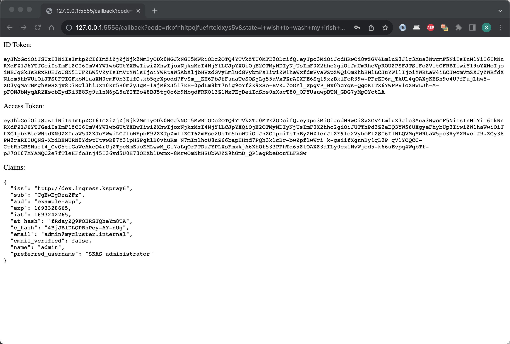

# DEX integration

[DEX](https://dexidp.io/) is an OpenID Connect provider. As such, will serve OpenID Connect clients to provide Single Sign On services.

It does not host any user identity information by itself, but rely on other Identity Provider for this, through configurable `connectors`.

A connector has been developed for SKAS. As DEX does not provide some extension mechanism, adding a connector requires 
to patch the code. So, a specific DEX image with a SKAS connector has been build.

Deploying DEX in standalone mode require to operation:

- Reconfigure SKAS to open a service for the usage of DEX (`login` service)
- Deploying DEX itself, with the proper connector configuration.

In the following, three variants of this configuration will be described. One with the connection in clear text, and two secured, with network encryption and inter-pod authentication.

> _Even if your target is a fully secured configuration, we suggest you first implement the unsecured, simplest variant, and then modify it incrementally, as described._

## Clear text connection

### SKAS reconfiguration

The login service is provided by the `skAuth` SKAS module. It is disabled by default and must be enabled to be used. 
Refer to [Architecture/Modules and interface](architecture.md#modules-and-interfaces) for more information

Here is a values file to enable this service: 

???+ abstract "values.skas.login.yaml"

    ``` { .yaml .copy } 
    skAuth:
      exposure:
        external:
          services:
            login:
              disabled: false
    ```

Note than, by default, the `skAuth` module provide only SSL encrypted service. This will be the case of our `login` service.

To deploy this configuration:

```shell
$ helm -n skas-system upgrade -i skas skas/skas --values ../../values.init.yaml \
--values ./values.skas.login.yaml
```

> _Don't forget to add the `values.init.yaml`, or to merge it in the `values.skas.yaml` file. Also, if you have others values file, they must be added on each upgrade_

> _And don't forget to restart the pod(s). See [Configuration: Pod restart](configuration.md#pod-restart)_

### DEX deployment

For this sample, we will use the official [DEX Helm chart](https://github.com/dexidp/helm-charts/tree/master/charts/dex). 
This will require some configuration, by providing a specific value file.

Here is such file (Some value will need to be adjusted to your context)

??? abstract "values.skas.login.yaml"

    ``` { .yaml .copy } 
    image:
      repository: ghcr.io/skasproject/dex
      tag: v2.37.0-skas-0.2.1
    
    config:
      issuer: http://dex.ingress.mycluster.internal
      storage:
        type: kubernetes
        config:
          inCluster: true
      web:
        http: 0.0.0.0:5556
      logger:
        level: info
        format: text
      oauth2:
        skipApprovalScreen: true
      connectors:
        - type: skas
          id: skas
          name: SKAS
          config:
            loginPrompt: "User"
            loginProvider:
              url: https://skas-auth.skas-system.svc
              insecureSkipVerify: true
    
      staticClients:
        - id: example-app
          redirectURIs:
            - 'http://127.0.0.1:5555/callback'
          name: 'Example App'
          secret: ZXhhbXBsZS1hcHAtc2VjcmV0
    
    securityContext:
      allowPrivilegeEscalation: false
      capabilities:
        drop:
          - ALL
      readOnlyRootFilesystem: false
      runAsNonRoot: true
      runAsUser: 1000
      seccompProfile:
        type: RuntimeDefault
    
    ingress:
      enabled: true
      className: nginx
      hosts:
        - host: dex.ingress.mycluster.internal
          paths:
            - path: /
              pathType: ImplementationSpecific
              backend:
                service:
                  name: dex
                  port:
                    number: 5556
    ```

Here are some comment about this values file:

- The `image` section target the SKAS patched image of DEX.
- The `config` section is the DEX configuration file. Refer to the 
[sample DEX config file](https://github.com/dexidp/dex/blob/master/examples/config-dev.yaml) for more explanation.
- The `config.issuer` value must be adjusted to your local DNS name. Note it is an unsecured URL.
- The `config.connnectors[0]` is the SKAS specific section. 
- The `config.connnectors[0].config.loginProvider.url` value targets the `skAuth` service. A noted above, 
this is an SSL encrypted service.
- The `config.connnectors[0].config.loginProvider.insecureSkipVerify` is set to `true`. As the targeted service is 
using HTTPS, we skip the certificate authority validation for this first sample.
- the `staticClients` section define a first OIDC client with parameter compatible with the `example-app` described below. 
- The `securityContext` section explicit some security constraints. This may be useful if your cluster implements 
some security restriction on running PODs. 
- The `ingress` section should be adjusted, at least for the `host:` url and maybe more if you use another ingress controller than nginx.  

As we will use the public DEX helm chart, its repo must first be defined:

```shell
$ helm repo add dex https://charts.dexidp.io
```

Then we can proceed to the DEX deployment:

```shell
$ helm -n skas-system upgrade -i dex dex/dex --values ./values.dex.yaml
```

If everything is OK, you should have two PODs running:

```shell
$ kubectl -n skas-system get pods
NAME                    READY   STATUS    RESTARTS   AGE
dex-54b4698bcd-9wbz6    1/1     Running   0          5h5m
skas-5cc75b8ff9-pw7nd   3/3     Running   0          6h23m
```

In case of problems, you may be want to check the resulting configuration. Unfortunately, this Helm chart store it in 
a secret. This means the configuration values are encoded en base64.

To display it, you can type:

```shell
$ kubectl get secret -n skas-system dex -o jsonpath="{ $.data.config\.yaml }" | base64 -d
```

If you modify some value in the `values.skas.login.yaml` file, execute again the Helm deployment command and restart the DEX Pod:

```shell
$ kubectl -n skas-system rollout restart deployment dex
```

### Testing

By convention all OIDC provider must provide a `well-known` endpoint which describe its other endpoints and other configuration values.

You can test this endpoint with the following command: 

```shell
$ curl http://dex.ingress.mycluster.internal/.well-known/openid-configuration
{
  "issuer": "http://dex.ingress.mycluster.internal",
  "authorization_endpoint": "http://dex.ingress.mycluster.internal/auth",
  "token_endpoint": "http://dex.ingress.mycluster.internal/token",
  "jwks_uri": "http://dex.ingress.mycluster.internal/keys",
  ....
```

This will ensure at least DEX is started and you ingress is functional.

> _Of course, you must adjust the URL to your context._ 

To go further, DEX provide a raw [example-app](https://github.com/dexidp/dex/tree/master/examples/example-app).
The main purpose of this application is to provide a starting point for developer to integrate an OIDC client in their 
code. But it also provide an interactive tool to test an OIDC service.

For your convenience, we have setup a repository to host binaries of this application, for several OS and processor.

For example, to download/install this binary for a Mac Intel:

```shell
$ cd /tmp
$ curl -L https://github.com/skasproject/dex-example-app/releases/download/2.37.0/example-app_2.37.0_darwin_amd64 -o ./example-app
$ sudo chmod 755 example-app
$ sudo mv example-app /usr/local/bin
```

```shell
$ example-app --issuer  http://dex.ingress.mycluster.internal
2023/08/28 18:50:07 listening on http://127.0.0.1:5555
```

Now, launch your browser to this provided link (`http://127.0.0.1:5555`). You should land on a page like this:


Click on the `Login` button. You should then land on a login page:


Enter a valid SKAS user account ('admin' for example) and you should land on a page like this:



This is not really 'user friendly', but it is a test application.

You can have a look on the log of SKAS and DEX logs. Also, you can test an invalid login.

> Of course, for this to work, you must fully preserve the configuration of `staticClients` in the DEX config file

DEX github repo also provide this `example-app` as a container. You can launch it as:

```shell
$ docker run -p 5555:5555 ghcr.io/dexidp/example-app:latest  example-app --issuer  http://dex.ingress.kspray6 --listen http://0.0.0.0:5555
2023/08/28 17:29:04 listening on http://0.0.0.0:5555
```

## Securing connection

The previous configuration has a major security issue: The login and password information are entered through a clear text connection. 

This following configuration will fix this point and also add authentication between DEX and SKAS and validate the SKAS certificate.

### SKAS reconfiguration

Here is the modified values file for SKAS reconfiguration.

???+ abstract "values.skas.login.yaml"

    ``` { .yaml .copy } 
    skAuth:
      exposure:
        external:
          services:
            login:
              disabled: false
              clients:
                - id: dex
                  secret: "aSharedSecret"
    ```

The service authentication has been activated.

To deploy this configuration, use the same command as previously:

```shell
$ helm -n skas-system upgrade -i skas skas/skas --values ../../values.init.yaml \
--values ./values.skas.login.yaml
```

> _And restart the POD_

### DEX deployment

And here is the modified values file for DEX deployment

??? abstract "values.skas.login.yaml"

    ``` { .yaml .copy }     
    image:
      repository: ghcr.io/skasproject/dex
      tag: v2.37.0-skas-0.2.1
    
    config:
      issuer: https://dex.ingress.mycluster.internal
      storage:
        type: kubernetes
        config:
          inCluster: true
      web:
        http: 0.0.0.0:5556
      logger:
        level: info
        format: text
      oauth2:
        skipApprovalScreen: true
      connectors:
        - type: skas
          id: skas
          name: SKAS
          config:
            loginPrompt: "User"
            loginProvider:
              url: https://skas-auth.skas-system.svc
              rootCaPath: ""
              rootCaData: "LS0tLS1CRUdJTiBDRVJU.......................ENFUlRJRklDQVRFLS0tLS0K"
              insecureSkipVerify: false
              clientAuth:
                id: "dex"
                secret: "aSharedSecret"
    
      staticClients:
        - id: example-app
          redirectURIs:
            - 'http://127.0.0.1:5555/callback'
          name: 'Example App'
          secret: ZXhhbXBsZS1hcHAtc2VjcmV0
    
    securityContext:
      allowPrivilegeEscalation: false
      capabilities:
        drop:
          - ALL
      readOnlyRootFilesystem: false
      runAsNonRoot: true
      runAsUser: 1000
      seccompProfile:
        type: RuntimeDefault
    
    ingress:
      enabled: true
      className: nginx
      annotations:
        cert-manager.io/cluster-issuer: cluster-issuer1
        nginx.ingress.kubernetes.io/force-ssl-redirect: "true"
      hosts:
        - host: dex.ingress.mycluster.internal
          paths:
            - path: /
              pathType: ImplementationSpecific
      tls:
        - secretName: dex-server-tls
          hosts:
            - dex.ingress.kspray6
    ```

The modification are the following:

- The `config.issuer` endpoint is now using HTTPS.
- The `config.connectors[0].config.loginProvider.rootCaData` is populated with the Certificate Authority of the 
  `skAuth` service. To find its value, we can dig inside its certificate, which include its authority:
  ```shell
  $ kubectl -n skas-system get secret skas-auth-cert -o=jsonpath='{.data.ca\.crt}'
  ```
- The `config.connectors[0].config.loginProvider.clientAuth` is set to authenticate with the id/secret defined above for `skAuth` login service.
- The `ingress` is now configured to handle SSL connection (And force SSL for non-SSL connection)

To apply this new configuration, use the same command as previously:

```shell
$ helm -n skas-system upgrade -i dex dex/dex --values ./values.dex.yaml
```

And restart the POD:

```shell
$ kubectl -n skas-system rollout restart deployment dex
```

### Testing

You can test again this endpoint with the following command. Note the https:// now on URLs

```shell
$ curl https://dex.ingress.mycluster.internal/.well-known/openid-configuration
{
  "issuer": "https://dex.ingress.kspray6",
  "authorization_endpoint": "https://dex.ingress.kspray6/auth",
  "token_endpoint": "https://dex.ingress.kspray6/token",
  "jwks_uri": "https://dex.ingress.kspray6/keys",
  "userinfo_endpoint": "https://dex.ingress.kspray6/userinfo", 
  ....
```

And use again the `example-app` application. Note the 'https://' on the issuer.

```shell
$ example-app --issuer  https://dex.ingress.mycluster.internal
2023/08/28 18:50:07 listening on http://127.0.0.1:5555
```

## Use a Kubernetes secret