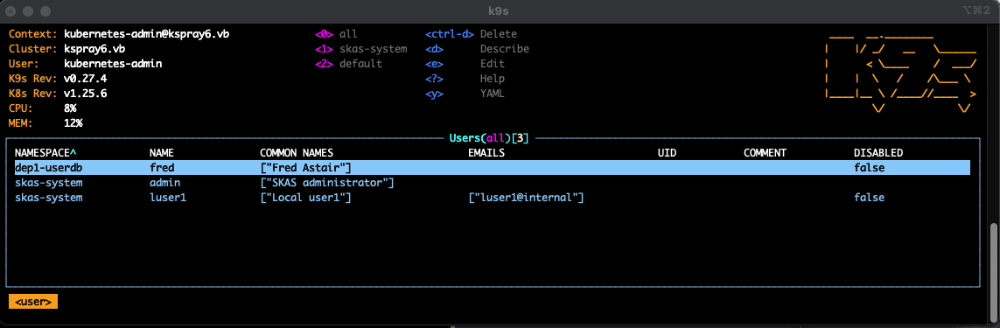
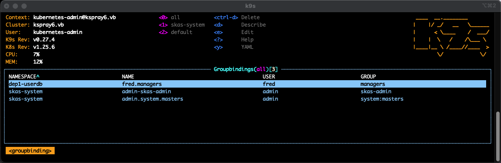
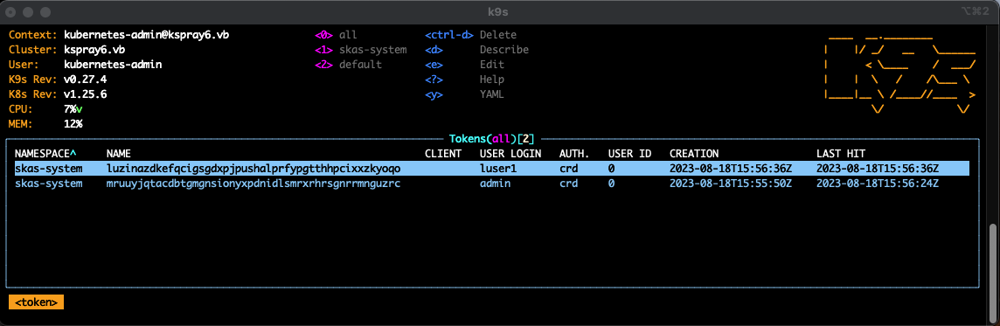
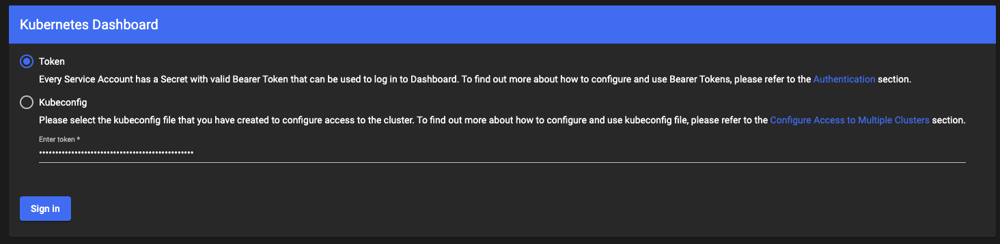

# Tools and Tricks

## reloader

Forgetting to restart a POD after a configuration change is a common source of errors. Fortunately, some tools can 
help for this. Such as [Reloader](https://github.com/stakater/Reloader)

The SKAS Helm chart add appropriate annotations on the `deployment`:  

```
apiVersion: apps/v1
kind: Deployment
metadata:
  annotations:
    configmap.reloader.stakater.com/reload: skas-merge-config,skas-auth-config,skas-crd-config,
```

> _The list of `configMap` is built dynamically by the Helm chart._

Of course, if Reloader is not installed in your cluster, this annotation will have no effect.

## Secret generator

As stated in [Two LDAP servers configuration](twoldapservers.md) o [Delegated users management](delegated.md), there is the need to generate 
a random secret in the deployment. For this, one can use [kubernetes-secret-generator](https://github.com/mittwald/kubernetes-secret-generator),
a custom kubernetes controller.

Here is a manifest which, once applied, will create the secret `skas2-client-secret` used the authenticate the communication between the two PODs of the two LDAP configuration referenced above.  

``` { .yaml .copy }
---
apiVersion: "secretgenerator.mittwald.de/v1alpha1"
kind: "StringSecret"
metadata:
  name: skas2-client-secret
  namespace: skas-system
spec:
  fields:
    - fieldName: "clientSecret"
      encoding: "base64"
      length: "15"
```

## k9s

We would like to say two words about this great tool which is [k9s](https://github.com/derailed/k9s)

As it is able to handle Custom Resources Definition out of the box, K9s is a perfect tool to dynamically display, modify or delete SKAS resources.

Note than, as User and Group are ambiguous names, which are used also by others API, alias are provided to ensure ambiguous access.

For example, you can access this screen under `skusers` resource name:



This one using `groupbindings`:



This one using `tokens`:



Of course, k9s can't do more than what the launching user is allowed to do. This user can be authenticated using SKAS, but it must have a minimum set of rights to behave correctly.

For example, you can launch k9s under the `admin` user account we have set up in the installation process (Provided it is member of the `system:masters` group).

```shell
$ kubectl sk login admin
Password:
logged successfully..

$ k9s
....
```

## Kubernetes dashboard

Login to the Kubernetes dashboard with SKAS is quite easy.

First, you must be logged using the CLI. Then using the `--all` option of the `kubectl sk whoami` command, you can get your current allocated token:

```shell
$ kubectl sk login admin
Password:
logged successfully..

$ kubectl sk whoami --all
USER    ID   GROUPS                      AUTH.   TOKEN
admin   0    skas-admin,system:masters   crd     znitotnewjbqbuolqacckvgxyhptoxsuykznrzdacuvdhimy
```

Now, you just have to cut and paste the token value in the dashboard login screen:



Of course, the set of operation you will be able to perform through the dashboard will be limited by the logged user's permissions.

## Tricks: Setup a meta helm chart

In [Two LDAP servers configuration](twoldapservers.md) and [Delegated users management](delegated.md), we had setup our configuration by performing two closely related Helm deployment.

To ease automation, it could be useful to 'package' such kind of deployment by creating a 'meta chart', a chart which will embed other ones as dependencies.

Such chart will have the following layout.

```shell
$ tree
.
|-- Chart.yaml
|-- templates
|   `-- stringsecret.yaml
`-- values.yaml
```

> This example will implement encryption and inter-pod authentication.

The `Chart.yaml` file define the meta-chart `skas-skas2-meta`.There is two dependencies deploying the same helm chart, 
but with different values (See below). Note the `alias: skas2` on the second deployment.

??? abstract "Chart.yaml"

    ``` { .yaml .copy }
    apiVersion: v2
    name: skas-skas2-meta
    version: 0.1.0
    dependencies:
    - name: skas
      version: 0.2.1
      repository: https://skasproject.github.io/skas-charts
    
    - name: skas
      alias: skas2
      version: 0.2.1
      repository: https://skasproject.github.io/skas-charts
    ```

The following will generate the shared secret allowing inter-pods authentication 

??? abstract " templates/stringsecret.yaml"

    ``` { .yaml .copy }
    ---
    apiVersion: "secretgenerator.mittwald.de/v1alpha1"
    kind: "StringSecret"
    metadata:
      name: skas2-client-secret
      namespace: skas-system
    spec:
      fields:
        - fieldName: "clientSecret"
          encoding: "base64"
          length: "15"
    ```

And here is the `values.yaml` file, with one version for the [Two LDAP servers configuration](twoldapservers.md):

??? abstract "values.yaml"

    ``` { .yaml .copy }
    # ======================================================== Main SKAS Pod configuration
    skas:
      clusterIssuer: your-cluster-issuer
    
      skAuth:
        exposure:
          external:
            ingress:
              host: skas.ingress.kspray6
        kubeconfig:
          context:
            name: skas@kspray6
          cluster:
            apiServerUrl: https://kubernetes.ingress.kspray6
    
      skMerge:
        providers:
          - name: crd
          - name: ldap1
            groupPattern: "dep1_%s"
          - name: ldap2
            groupPattern: "dep2_%s"
    
        providerInfo:
          crd:
            url: http://localhost:7012
          ldap1:
            url: http://localhost:7013
          ldap2:
            url: https://skas-skas2-ldap.skas-system.svc # Was https://skas2-ldap.skas-system.svc
            rootCaPath: /tmp/cert/ldap2/ca.crt
            insecureSkipVerify: false
            clientAuth:
              id: skMerge
              secret: ${LDAP2_CLIENT_SECRET}
    
        extraEnv:
          - name: LDAP2_CLIENT_SECRET
            valueFrom:
              secretKeyRef:
                name: ldap2-client-secret
                key: clientSecret
    
        extraSecrets:
          - secret: skas-skas2-ldap-cert # Was skas2-ldap-cert
            volume: ldap2-cert
            mountPath: /tmp/cert/ldap2
    
      skLdap:
        enabled: true
        # --------------------------------- LDAP configuration
        ldap:
          host: ldap1.mydomain.internal
          insecureNoSSL: false
          rootCaData: "LS0tLS1CRUdJTiBDRVJUSUZ................................lRJRklDQVRFLS0tLS0K"
          bindDN: cn=Manager,dc=mydomain1,dc=internal
          bindPW: admin123
          groupSearch:
            baseDN: ou=Groups,dc=mydomain1,dc=internal
            filter: (objectClass=posixgroup)
            linkGroupAttr: memberUid
            linkUserAttr: uid
            nameAttr: cn
          timeoutSec: 10
          userSearch:
            baseDN: ou=Users,dc=mydomain,dc=internal
            cnAttr: cn
            emailAttr: mail
            filter: (objectClass=inetOrgPerson)
            loginAttr: uid
            numericalIdAttr: uidNumber
    
    # ======================================================== SKAS2 Pod configuration
    skas2:
      skAuth:
        enabled: false
    
      skMerge:
        enabled: false
    
      skCrd:
        enabled: false
    
      clusterIssuer: your-cluster-issuer
    
      skLdap:
        enabled: true
        # --------------------------------- LDAP configuration
        ldap:
          host: ldap2.mydomain.internal
          insecureNoSSL: false
          rootCaData: "LS0tLS1CRUdJTiBDRVJUSUZ................................lRJRklDQVRFLS0tLS0K"
          bindDN: cn=Manager,dc=mydomain2,dc=internal
          bindPW: admin123
          groupSearch:
            baseDN: ou=Groups,dc=mydomain2,dc=internal
            filter: (objectClass=posixgroup)
            linkGroupAttr: memberUid
            linkUserAttr: uid
            nameAttr: cn
          timeoutSec: 10
          userSearch:
            baseDN: ou=Users,dc=mydomain,dc=internal
            cnAttr: cn
            emailAttr: mail
            filter: (objectClass=inetOrgPerson)
            loginAttr: uid
           numericalIdAttr: uidNumber
    
    
        # By default, only internal (localhost) server is activated, to be called by another container running in the same pod.
        # Optionally, another server (external) can be activated, which can be accessed through a kubernetes service
        # In such case:
        # - A Client list should be provided to control access.
        # - ssl: true is strongly recommended.
        # - And protection against BFA should be activated (protected: true)
        exposure:
          internal:
            enabled: false
          external:
            enabled: true
            port: 7113
            ssl: true
            services:
              identity:
                disabled: false
                clients:
                  - id: skMerge
                    secret: ${LDAP2_CLIENT_SECRET}
                protected: true
    
        extraEnv:
          - name: LDAP2_CLIENT_SECRET
            valueFrom:
              secretKeyRef:
                name: ldap2-client-secret
                key: clientSecret
    ```

and one for [Delegated users management](delegated.md).

??? abstract "values.yaml"
    
    ``` { .yaml .copy }
    skas:
      skAuth:
        exposure:
          external:
            ingress:
              host: skas.ingress.kspray6
        kubeconfig:
          context:
            name: skas@kspray6
          cluster:
            apiServerUrl: https://kubernetes.ingress.kspray6

      skMerge:
        providers:
          - name: crd
          - name: crd_dep1
            groupPattern: "dep1-%s"
    
        providerInfo:
          crd:
            url: http://localhost:7012
          crd_dep1:
            url: https://skas-skas2-crd.skas-system.svc # Was https://skas2-crd.skas-system.svc
            rootCaPath: /tmp/cert/skas2/ca.crt
            insecureSkipVerify: false
            clientAuth:
              id: skMerge
              secret: ${SKAS2_CLIENT_SECRET}
    
        extraEnv:
          - name: SKAS2_CLIENT_SECRET
            valueFrom:
              secretKeyRef:
                name: skas2-client-secret
                key: clientSecret
    
        extraSecrets:
          - secret: skas-skas2-crd-cert  # Was skas2-crd-cert
            volume: skas2-cert
            mountPath: /tmp/cert/skas2
    
    
    skas2:
      skAuth:
        enabled: false
      skMerge:
        enabled: false
      skLdap:
        enabled: false
    
      clusterIssuer: your-cluster-issuer
    
      skCrd:
        enabled: true
        namespace: dep1-userdb
    
        adminGroups:
          - dep1-admin
    
        initialUser:
          login: dep1-admin
          passwordHash: $2a$10$ijE4zPB2nf49KhVzVJRJE.GPYBiSgnsAHM04YkBluNaB3Vy8Cwv.G  # admin
          commonNames: [ "DEP1 administrator" ]
          groups:
            - admin
    
        # By default, only internal (localhost) server is activated, to be called by another container running in the same pod.
        # Optionally, another server (external) can be activated, which can be accessed through a kubernetes service
        # In such case:
        # - A Client list should be provided to control access.
        # - ssl: true is strongly recommended.
        # - And protection against BFA should be activated (protected: true)
        exposure:
          internal:
            enabled: false
          external:
            enabled: true
            port: 7112
            ssl: true
            services:
              identity:
                disabled: false
                clients:
                  - id: "skMerge"
                    secret: ${SKAS2_CLIENT_SECRET}
                protected: true
    
        extraEnv:
          - name: SKAS2_CLIENT_SECRET
            valueFrom:
              secretKeyRef:
                name: skas2-client-secret
                key: clientSecret
    ```

There is two blocks: `skas` and `skas2`, matching the name or alias in the `Chart.yaml` file.

These two block hold the same definition than the ones defined in the original configuration. With two differences:

- `skas.skMerge.providerInfo.ldap2.url: https://skas-skas2-ldap.skas-system.svc`<br>or<br> 
  `skas.skMerge.providerInfo.crd_dep1.url: https://skas-skas2-crd.skas-system.svc`
- `skas.skMerge.extraSecrets[0].secret: skas-skas2-ldap-cert`<br>  or<br>
  `skas.skMerge.extraSecrets[0].secret: skas-skas2-crd-cert`


This to accommodate service and secret name change, due to aliasing of the second dependency.

Then, to launch the deployment, in the same folder as `Chart.yaml`, execute:

```shell
$ helm dependency build && helm -n skas-system upgrade -i skas .
```

## Tricks: Handle two different sessions

When working on user permissions, it could be useful to have separate session, at least one as admin, and one as a user to test its capability.

But the default Kubernetes configuration is not bound to a terminal session, but to a user. 
So, any modification (`kubectl config ....`) of the local configuration will have effect on all session.

The solution is to change the location of the kubernetes configuration for a given session, by modifying the `KUBECONFIG` environment variable: 

```shell
$ export KUBECONFIG=/tmp/kconfig
```

> `/tmp/kconfig` may be an empty or un-existing file

Then you can initialize a new Kubernetes/SKAS context

```shell
$ kubectl sk init https://skas.ingress.mycluster.internal
Setup new context 'skas@mycluster.internal' in kubeconfig file '/tmp/kconfig'
```


