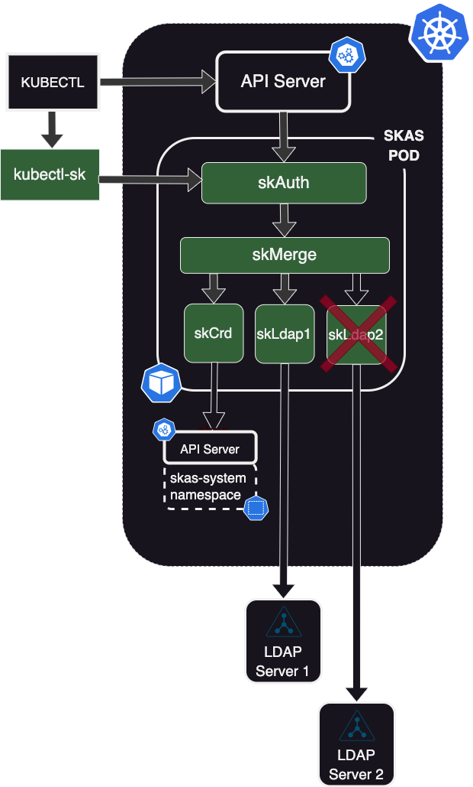

# Two LDAP servers configuration

## Adding a second LDAP server

> _As the two configurations are quite similar, there is a lot of redundancy between this chapter and [Delegated users management](delegated.md) chapter_

{ align=right width=300}

The obvious solution to add a second LDAP server would be to duplicate the `skLdap` Identity Provider container, hook it under the `skMerge` module and link it to our second LDAP server.

Unfortunately, the provided SKAS helm chart does not allow several instance of whatever container. Doing so would be possible, but at the price of a more complex chart.

A possible solution would be to modify the chart by adding this second LDAP IDP. However, it's best to avoid such specific forks if possible.

{width=700}

{ align=left width=350}

A more convenient solution will be to create another POD hosting only the new LDAP IDP.

This pod will be instantiated using the same SKAS helm chart, under another release name. And all other modules than `skLdap` will be disabled.

When all modules are in the same POD, inter-module communication use the `localhost` internal POD network.
In this case, as the second `skLdap` module run in another POD, communication must go through a kubernetes service.

This configuration requires two steps:

- Setup a new Helm deployment for the `skas2` secondary pod.
- Reconfigure the `skMerge` module of the main SKAS pod to connect to this new IDP.

{width=700}

In the following section, we will describe three variants of this configuration: one with a clear text connection and two secured variants with network encryption and inter-pod authentication.

> _We recommend starting with the unsecured, simplest variant even if your ultimate goal is a fully secured configuration. You can then incrementally modify it as described._

## Clear text connection

### Secondary POD configuration

Here is a sample values file for configuring the secondary POD:

??? abstract "values.skas2.yaml"

    ``` { .yaml .copy }
    skAuth:
      enabled: false
    skMerge:
      enabled: false
    skCrd:
      enabled: false
    
    skLdap:
      enabled: true
      # --------------------------------- LDAP configuration
      ldap:
        host: ldap2.mydomain.internal
        insecureNoSSL: false
        rootCaData: "LS0tLS1CRUdJTiBDRVJUSUZ................................lRJRklDQVRFLS0tLS0K"
        bindDN: cn=Manager,dc=mydomain2,dc=internal
        bindPW: admin123
        groupSearch:
          baseDN: ou=Groups,dc=mydomain2,dc=internal
          filter: (objectClass=posixgroup)
          linkGroupAttr: memberUid
          linkUserAttr: uid
          nameAttr: cn
        timeoutSec: 10
        userSearch:
          baseDN: ou=Users,dc=mydomain,dc=internal
          cnAttr: cn
          emailAttr: mail
          filter: (objectClass=inetOrgPerson)
          loginAttr: uid
          numericalIdAttr: uidNumber
    
    
      # By default, only internal (localhost) server is activated, to be called by another container running in the same pod.
      # Optionally, another server (external) can be activated, which can be accessed through a kubernetes service
      # In such case:
      # - A Client list should be provided to control access.
      # - ssl: true is strongly recommended.
      # - And protection against BFA should be activated (protected: true)
      exposure:
        internal:
          enabled: false
        external:
          enabled: true
          port: 7113
          ssl: false
          services:
            identity:
              disabled: false
              clients:
                - id: "*"
                  secret: "*"
              protected: true
    ```

At the beginning of the file, we disable all modules except for `skLdap`.

Then, you will need to adjust the configuration for the second LDAP server according to your specific context. Please refer to [LDAP Setup](./ldap.md) for guidance."

Then, there is the `exposure` part, who define how this service will be exposed. (The default configuration is expose to `localhost` in clear text)

- `exposure.internal.enabled: false` shutdown the HTTP server bound to localhost.
- `exposure.external.enabled: true` set up the HTTP server bound on the POD IP. This run on port 7113 with no SSL.
- Then the is the configuration of the `identity` service to expose:
    - `clients[]` is a mechanism to validate who is able to access this service, by providing an `id` and a `secret`
      (or password). the values "*" will disable this feature.
    - `protected: true` activate an internal mechanism against attacks of type 'Brut force', by introducing delays on
      unsuccessful connection attempts, and by limiting the number of simultaneous connections. There is no reason to
      disable it, except if you suspect a misbehavior.

To deploy this configuration, execute:

```{.shell .copy}
helm -n skas-system install skas2 skas/skas --values ./values.skas2.yaml
```

> **Note the `skas2' release name**

The Helm chart will deploy the new pod(s) under the name `skas2` and also create an associated Kubernetes `service`.

### Main pod reconfiguration

The second step is to reconfigure the main pod. Here is a sample of the appropriate configuration:

??? abstract "values.skas.yaml"

    ``` { .yaml .copy }
    skMerge:
      providers:
        - name: crd
        - name: ldap1
          groupPattern: "dep1_%s"
        - name: ldap2
          groupPattern: "dep2_%s"
    
      providerInfo:
        crd:
          url: http://localhost:7012
        ldap1:
          url: http://localhost:7013
        ldap2:
          url: http://skas2-ldap.skas-system.svc
    
    skLdap:
      enabled: true
      # --------------------------------- LDAP configuration
      ldap:
        host: ldap1.mydomain.internal
        insecureNoSSL: false
        rootCaData: "LS0tLS1CRUdJTiBDRVJUSUZ................................lRJRklDQVRFLS0tLS0K"
        bindDN: cn=Manager,dc=mydomain1,dc=internal
        bindPW: admin123
        groupSearch:
          baseDN: ou=Groups,dc=mydomain1,dc=internal
          filter: (objectClass=posixgroup)
          linkGroupAttr: memberUid
          linkUserAttr: uid
          nameAttr: cn
        timeoutSec: 10
        userSearch:
          baseDN: ou=Users,dc=mydomain,dc=internal
          cnAttr: cn
          emailAttr: mail
          filter: (objectClass=inetOrgPerson)
          loginAttr: uid
          numericalIdAttr: uidNumber
    ```


At the top of the `skMerge` module, there are two entries designed to configure a provider:

- `providers` is a list of connected providers, which allows you to define their behavior. The order of providers in 
this list is important. For more information, refer to the 
[Identity Provider chaining: Provider configuration](chaining.md#provider-configuration) chapter.

- `providerInfo` is a map that provides information on how to reach these providers. For `crd` and `ldap1`, we use 
the default localhost port. For `ldap2`, we use the service created by the skas2 deployment. 

The link between these two entries is, of course, the provider name.

Next, there is the configuration for the primary LDAP server, which must be adapted to your specific configuration."

The reconfiguration must then be applied by executing this command:

```{ .shell .copy}
helm -n skas-system upgrade skas skas/skas --values ./values.init.yaml --values ./values.skas.yaml
```

> _Don't forget to include the `values.init.yaml` file or merge it into the `values.skas.yaml` file. Additionally, 
if you have other values files, make sure to include them in each upgrade._

> _Also, remember to restart the pod(s) after making these configuration changes. You can find more information on how 
to do this in the [Configuration: Pod restart](configuration.md#pod-restart) section._

## Test

Now, you can test your configuration:

```shell
$ kubectl sk user describe nobody  --explain
> USER     STATUS         UID   GROUPS   EMAILS   COMMON NAMES   AUTH
> nobody   userNotFound   0

> Detail:
> PROVIDER   STATUS         UID   GROUPS   EMAILS   COMMON NAMES
> crd        userNotFound   0
> ldap1      userNotFound   0
> ldap2      userNotFound   0
```

You can check that both LDAP servers are taken into account. This also ensures that connections to both LDAP servers 
are effective, as a provider is `critical` by default (Refers to the 
[Identity Provider chaining: Provider configuration](chaining.md#provider-configuration) chapter

Of course, another test will be to describe some users existing in your LDAP servers.

## Securing connection

It should be noted that unencrypted passwords will transit through the link between the two pods. Therefore, setting up encryption is a must-have.

### Secondary POD configuration

Here is the modified version for the `skas2` pod configuration:

??? abstract "values.skas2.yaml"

    ``` { .yaml .copy }
    skAuth:
      enabled: false
    skMerge:
      enabled: false
    skCrd:
      enabled: false
    
    clusterIssuer: your-cluster-issuer
    
    skLdap:
      enabled: true
      # --------------------------------- LDAP configuration
      ldap:
        host: ldap2.mydomain.internal
        insecureNoSSL: false
        rootCaData: "LS0tLS1CRUdJTiBDRVJUSUZ................................lRJRklDQVRFLS0tLS0K"
        bindDN: cn=Manager,dc=mydomain2,dc=internal
        bindPW: admin123
        groupSearch:
          baseDN: ou=Groups,dc=mydomain2,dc=internal
          filter: (objectClass=posixgroup)
          linkGroupAttr: memberUid
          linkUserAttr: uid
          nameAttr: cn
        timeoutSec: 10
        userSearch:
          baseDN: ou=Users,dc=mydomain,dc=internal
          cnAttr: cn
          emailAttr: mail
          filter: (objectClass=inetOrgPerson)
          loginAttr: uid
          numericalIdAttr: uidNumber
    
    
      # By default, only internal (localhost) server is activated, to be called by another container running in the same pod.
      # Optionally, another server (external) can be activated, which can be accessed through a kubernetes service
      # In such case:
      # - A Client list should be provided to control access.
      # - ssl: true is strongly recommended.
      # - And protection against BFA should be activated (protected: true)
      exposure:
        internal:
          enabled: false
        external:
          enabled: true
          port: 7113
          ssl: true
          services:
            identity:
              disabled: false
              clients:
                - id: skMerge
                  secret: aSharedSecret
              protected: true
    ```

The differences are as follows:

- There is a `clusterIssuer` definition to enable the generation of a certificate. (It is assumed here that 
`cert-manager` is deployed in the cluster).
- `exposure.external.ssl` is set to `true`. This will also lead to the generation of the server certificate.
- The `service.identity.clients` authentication is also activated. The `id` and `secret` values will have to be 
provided by the `skMerge` client.

To deploy this configuration:

```{.shell .copy}
helm -n skas-system install skas2 skas/skas --values ./values.skas2.yaml
```
> **Note the `skas2' release name**

The Helm chart will deploy the new pod(s) with the name `skas2`. It will also deploy an associated Kubernetes `service`
and submit a `cert-manager.io/v1/Certificate` request.

### Main pod reconfiguration

Here is the modified version for the main SKAS POD configuration:

??? abstract "values.skas.yaml"

    ``` { .yaml .copy }
    skMerge:
      providers:
        - name: crd
        - name: ldap1
          groupPattern: "dep1_%s"
        - name: ldap2
          groupPattern: "dep2_%s"
    
      providerInfo:
        crd:
          url: http://localhost:7012
        ldap1:
          url: http://localhost:7013
        ldap2:
          url: https://skas2-ldap.skas-system.svc
          rootCaPath: /tmp/cert/ldap2/ca.crt
          insecureSkipVerify: false
          clientAuth:
            id: skMerge
            secret: aSharedSecret
    
      extraSecrets:
        - secret: skas2-ldap-cert
          volume: ldap2-cert
          mountPath: /tmp/cert/ldap2
    
    skLdap:
      enabled: true
      # --------------------------------- LDAP configuration
      ldap:
        host: ldap1.mydomain.internal
        insecureNoSSL: false
        rootCaData: "LS0tLS1CRUdJTiBDRVJUSUZ................................lRJRklDQVRFLS0tLS0K"
        bindDN: cn=Manager,dc=mydomain1,dc=internal
        bindPW: admin123
        groupSearch:
          baseDN: ou=Groups,dc=mydomain1,dc=internal
          filter: (objectClass=posixgroup)
          linkGroupAttr: memberUid
          linkUserAttr: uid
          nameAttr: cn
        timeoutSec: 10
        userSearch:
          baseDN: ou=Users,dc=mydomain,dc=internal
          cnAttr: cn
          emailAttr: mail
          filter: (objectClass=inetOrgPerson)
          loginAttr: uid
          numericalIdAttr: uidNumber
    ```

The `providerInfo.ldap2` has been modified for SSL and authenticated connection:

- `url` begins with `https`.
- `clientAuth` provides information to authenticate against the `skLdap2` pod.
- `insecureSkipVerify` is set to `false`, as we want to check certificate validity.
- `rootCaPath` is set to access the `ca.crt`, the CA validating the `skLdap2` server certificate.

As stated above, during the deployment of the `skas2` secondary POD, a server certificate was generated to allow 
SSL-enabled services. This certificate is stored in a secret (of type `kubernetes.io/tls`) named `skas2-ldap-cert`. 
Alongside the private/public key pair, it also contains the root Certificate Authority under the name `ca.crt`.

The `skMerge.extraSecrets` subsection instructs the POD to mount this secret at the defined location. 
The property `skMerge.providerInfo.ldap2.rootCaPath` can now reference the mounted value.

Then, the reconfiguration must be applied:

```{ .shell .copy}
helm -n skas-system upgrade skas skas/skas --values ./values.init.yaml --values ./values.skas.yaml
```

> _Don't forget to include the `values.init.yaml` file or merge it into the `values.skas.yaml` file. Additionally,
if you have other values files, make sure to include them in each upgrade._

> _Also, remember to restart the pod(s) after making these configuration changes. You can find more information on how
to do this in the [Configuration: Pod restart](configuration.md#pod-restart) section._

You can now test again your configuration, as [described above](#test)


## Using a Kubernetes secrets

There is still a security issue because the shared secret (`aSharedSecret`) is stored in plain text in both values 
files, which could lead to it being accidentally committed to a version control system.

The best practice is to store the secret value in a Kubernetes `secret` resource, like this:

``` { .yaml .copy }
---
apiVersion: v1
kind: Secret
metadata:
  name: skas2-client-secret
  namespace: skas-system
data:
  clientSecret: Sk1rbkNyYW5WV1YwR0E5
type: Opaque
```

Where `data.clientSecret` is the secret encoded in base64.

> There are several solutions to generate such a secret value. One can use Helm with a random generator function. Another one is to use a [Secret generator](toolsandtricks.md#secret-generator)."

### Secondary POD configuration

To use this secret, here is the new modified version of the `skas2` POD configuration:

??? abstract "values.skas2.yaml"

    ``` { .yaml .copy }
    skAuth:
      enabled: false
    skMerge:
      enabled: false
    skCrd:
      enabled: false
    
    clusterIssuer: your-cluster-issuer
    
    skLdap:
      enabled: true
      # --------------------------------- LDAP configuration
      ldap:
        host: ldap2.mydomain.internal
        insecureNoSSL: false
        rootCaData: "LS0tLS1CRUdJTiBDRVJUSUZ................................lRJRklDQVRFLS0tLS0K"
        bindDN: cn=Manager,dc=mydomain2,dc=internal
        bindPW: admin123
        groupSearch:
          baseDN: ou=Groups,dc=mydomain2,dc=internal
          filter: (objectClass=posixgroup)
          linkGroupAttr: memberUid
          linkUserAttr: uid
          nameAttr: cn
        timeoutSec: 10
        userSearch:
          baseDN: ou=Users,dc=mydomain,dc=internal
          cnAttr: cn
          emailAttr: mail
          filter: (objectClass=inetOrgPerson)
          loginAttr: uid
          numericalIdAttr: uidNumber
    
      # By default, only internal (localhost) server is activated, to be called by another container running in the same pod.
      # Optionally, another server (external) can be activated, which can be accessed through a kubernetes service
      # In such case:
      # - A Client list should be provided to control access.
      # - ssl: true is strongly recommended.
      # - And protection against BFA should be activated (protected: true)
      exposure:
        internal:
          enabled: false
        external:
          enabled: true
          port: 7113
          ssl: true
          services:
            identity:
              disabled: false
              clients:
                - id: skMerge
                  secret: ${SKAS2_CLIENT_SECRET}
              protected: true
    
      extraEnv:
        - name: SKAS2_CLIENT_SECRET
          valueFrom:
            secretKeyRef:
              name: skas2-client-secret
              key: clientSecret
    ```

The modifications are as follows:

- The `skLdap.extraEnv` subsection injects the secret value as an environment variable into the container.
- The `skLdap.exposure.external.services.identity.clients[0].secret` retrieves its value through this environment variable.

> Most of the values provided by the Helm chart end up inside a ConfigMap, which is then loaded by the SKAS executable. 
Environment variable interpolation occurs during this loading process.

### Main pod reconfiguration

Here is the modified version of the main SKAS pod configuration, which incorporates `secret` handling:

??? abstract "values.skas.yaml"

    ``` { .yaml .copy }
    skMerge:
      providers:
        - name: crd
        - name: ldap1
          groupPattern: "dep1_%s"
        - name: ldap2
          groupPattern: "dep2_%s"
    
      providerInfo:
        crd:
          url: http://localhost:7012
        ldap1:
          url: http://localhost:7013
        ldap2:
          url: https://skas2-ldap.skas-system.svc
          rootCaPath: /tmp/cert/ldap2/ca.crt
          insecureSkipVerify: false
          clientAuth:
            id: skMerge
            secret: ${SKAS2_CLIENT_SECRET}
    
      extraEnv:
        - name: SKAS2_CLIENT_SECRET
          valueFrom:
            secretKeyRef:
              name: skas2-client-secret
              key: clientSecret
    
      extraSecrets:
        - secret: skas2-ldap-cert
          volume: ldap2-cert
          mountPath: /tmp/cert/ldap2
    
    skLdap:
      enabled: true
      # --------------------------------- LDAP configuration
      ldap:
        host: ldap1.mydomain.internal
        insecureNoSSL: false
        rootCaData: "LS0tLS1CRUdJTiBDRVJUSUZ................................lRJRklDQVRFLS0tLS0K"
        bindDN: cn=Manager,dc=mydomain1,dc=internal
        bindPW: admin123
        groupSearch:
          baseDN: ou=Groups,dc=mydomain1,dc=internal
          filter: (objectClass=posixgroup)
          linkGroupAttr: memberUid
          linkUserAttr: uid
          nameAttr: cn
        timeoutSec: 10
        userSearch:
          baseDN: ou=Users,dc=mydomain,dc=internal
          cnAttr: cn
          emailAttr: mail
          filter: (objectClass=inetOrgPerson)
          loginAttr: uid
          numericalIdAttr: uidNumber
    ```

The modifications for the `skMerge` module are the same as those made for the SKAS2 POD.

## Set up a meta helm chart

Up to this point, we have configured our deployment by performing two closely related Helm deployments. 
To simplify automation, it can be helpful to create a 'meta chart,' a chart that includes other charts as dependencies.

Such a chart will have the following layout:

```shell
.
|-- Chart.yaml
|-- templates
|   `-- stringsecret.yaml
`-- values.yaml
```

> In this example, we will implement encryption and inter-pod authentication.

The `Chart.yaml` file defines the meta-chart `skas-skas2-meta`. It has two dependencies that deploy the same Helm 
chart but with different values (as shown below). Please note the `alias: skas2` in the second deployment.

???+ abstract "Chart.yaml"

    ``` { .yaml .copy }
    apiVersion: v2
    name: skas-skas2-meta
    version: 0.1.0
    dependencies:
    - name: skas
      version: 0.2.2
      repository: https://skasproject.github.io/skas-charts
    
    - name: skas
      alias: skas2
      version: 0.2.2
      repository: https://skasproject.github.io/skas-charts
    ```

The following manifest will generate the shared secret required for inter-pod authentication.

??? abstract " templates/stringsecret.yaml"

    ``` { .yaml .copy }
    ---
    apiVersion: "secretgenerator.mittwald.de/v1alpha1"
    kind: "StringSecret"
    metadata:
      name: skas2-client-secret
      namespace: skas-system
    spec:
      fields:
        - fieldName: "clientSecret"
          encoding: "base64"
          length: "15"
    ```

And here is the global `values.yaml` file: 

??? abstract "values.yaml"

    ``` { .yaml .copy }
    # ======================================================== Main SKAS Pod configuration
    skas:
      clusterIssuer: your-cluster-issuer
    
      skAuth:
        exposure:
          external:
            ingress:
              host: skas.ingress.kspray6
        kubeconfig:
          context:
            name: skas@kspray6
          cluster:
            apiServerUrl: https://kubernetes.ingress.kspray6
    
      skMerge:
        providers:
          - name: crd
          - name: ldap1
            groupPattern: "dep1_%s"
          - name: ldap2
            groupPattern: "dep2_%s"
    
        providerInfo:
          crd:
            url: http://localhost:7012
          ldap1:
            url: http://localhost:7013
          ldap2:
            url: https://skas-skas2-ldap.skas-system.svc # Was https://skas2-ldap.skas-system.svc
            rootCaPath: /tmp/cert/ldap2/ca.crt
            insecureSkipVerify: false
            clientAuth:
              id: skMerge
              secret: ${LDAP2_CLIENT_SECRET}
    
        extraEnv:
          - name: LDAP2_CLIENT_SECRET
            valueFrom:
              secretKeyRef:
                name: ldap2-client-secret
                key: clientSecret
    
        extraSecrets:
          - secret: skas-skas2-ldap-cert # Was skas2-ldap-cert
            volume: ldap2-cert
            mountPath: /tmp/cert/ldap2
    
      skLdap:
        enabled: true
        # --------------------------------- LDAP configuration
        ldap:
          host: ldap1.mydomain.internal
          insecureNoSSL: false
          rootCaData: "LS0tLS1CRUdJTiBDRVJUSUZ................................lRJRklDQVRFLS0tLS0K"
          bindDN: cn=Manager,dc=mydomain1,dc=internal
          bindPW: admin123
          groupSearch:
            baseDN: ou=Groups,dc=mydomain1,dc=internal
            filter: (objectClass=posixgroup)
            linkGroupAttr: memberUid
            linkUserAttr: uid
            nameAttr: cn
          timeoutSec: 10
          userSearch:
            baseDN: ou=Users,dc=mydomain,dc=internal
            cnAttr: cn
            emailAttr: mail
            filter: (objectClass=inetOrgPerson)
            loginAttr: uid
            numericalIdAttr: uidNumber
    
    # ======================================================== SKAS2 Pod configuration
    skas2:
      skAuth:
        enabled: false
    
      skMerge:
        enabled: false
    
      skCrd:
        enabled: false
    
      clusterIssuer: your-cluster-issuer
    
      skLdap:
        enabled: true
        # --------------------------------- LDAP configuration
        ldap:
          host: ldap2.mydomain.internal
          insecureNoSSL: false
          rootCaData: "LS0tLS1CRUdJTiBDRVJUSUZ................................lRJRklDQVRFLS0tLS0K"
          bindDN: cn=Manager,dc=mydomain2,dc=internal
          bindPW: admin123
          groupSearch:
            baseDN: ou=Groups,dc=mydomain2,dc=internal
            filter: (objectClass=posixgroup)
            linkGroupAttr: memberUid
            linkUserAttr: uid
            nameAttr: cn
          timeoutSec: 10
          userSearch:
            baseDN: ou=Users,dc=mydomain,dc=internal
            cnAttr: cn
            emailAttr: mail
            filter: (objectClass=inetOrgPerson)
            loginAttr: uid
           numericalIdAttr: uidNumber
    
    
        # By default, only internal (localhost) server is activated, to be called by another container running in the same pod.
        # Optionally, another server (external) can be activated, which can be accessed through a kubernetes service
        # In such case:
        # - A Client list should be provided to control access.
        # - ssl: true is strongly recommended.
        # - And protection against BFA should be activated (protected: true)
        exposure:
          internal:
            enabled: false
          external:
            enabled: true
            port: 7113
            ssl: true
            services:
              identity:
                disabled: false
                clients:
                  - id: skMerge
                    secret: ${LDAP2_CLIENT_SECRET}
                protected: true
    
        extraEnv:
          - name: LDAP2_CLIENT_SECRET
            valueFrom:
              secretKeyRef:
                name: ldap2-client-secret
                key: clientSecret
    ```

There are two blocks: `skas` and `skas2`, matching the name or alias in the `Chart.yaml` file.

These two blocks hold the same definitions as the ones defined in the original configuration, with two differences:

- `skas.skMerge.providerInfo.ldap2.url: https://skas-skas2-ldap.skas-system.svc`
- `skas.skMerge.extraSecrets[0].secret: skas-skas2-ldap-cert`

This is to accommodate service and secret name changes due to aliasing of the second dependency.

Then, to launch the deployment, in the same folder as `Chart.yaml`, execute:

```{.shell .copy}
helm dependency build && helm -n skas-system upgrade -i skas .
```


